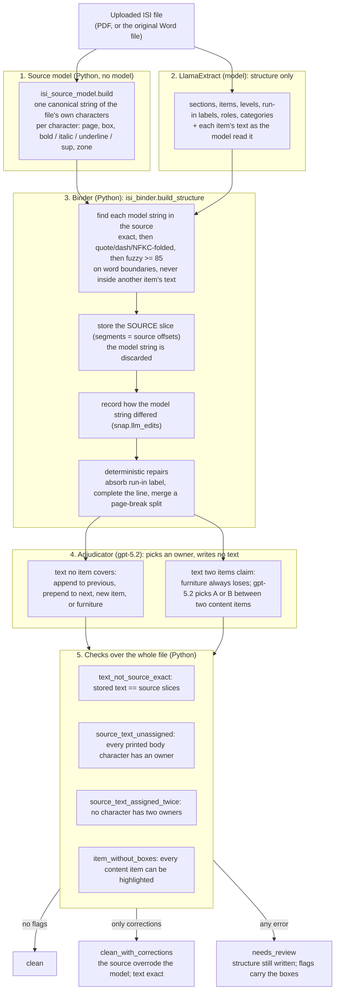

### 1.2 How the ISI text is 100% accurate

**What "100%" means here.** Every character stored in `isi_structure.json` (headings, item text,
run-in labels) is a character of the uploaded file itself, copied by Python. No model writes text
that is stored. This is enforced by a check on every node, not just by design: a node whose text
is not exactly its source characters fails the run's review (`text_not_source_exact`, an error).

The models only decide **structure**: where a section starts, which sentences form one item, which
text is a label, a heading or page furniture. A structure problem the code can detect becomes a
flag; it is never written silently.

**Why a model mistake cannot become approved wording.** A model string is used only to *find* a
span of the file. Whatever the model changed in that string, the stored text is the span:

| Model returned | Stored (the file's characters) | Recorded as |
|---|---|---|
| "…performed by the **prescber** prior to…" | "…performed by the **prescriber** prior to…" | fuzzy match, `item_corrected_from_source` |
| "10 to 14 days" (model "fixed" a typo) | "10 to14 days" (the file's typo, which the asset must match) | edit in `snap.llm_edits` |
| label "Hypersensitivity Reactions:" returned apart from the text | "Hypersensitivity Reactions: Hypersensitivity reactions, including…" | `label_absorbed` |
| "…clinical judgment should" (p1) + "be considered based on…" (p2) | one item over pages 1–2, the running footer skipped | `page_break_merged` |
| a sentence the model skipped | added to the item on the same line, or given an owner by gpt-5.2 | `line_completed` / `adjudicated` |
| text the file does not contain (e.g. an icon description) | nothing | `item_dropped_not_printed` once every printed character has an owner, else `item_not_in_source` (error) |

**How each layer contributes.**

| Layer | Deterministic? | Can it change stored characters? | If it goes wrong |
|---|---|---|---|
| Source model (text layer / Word XML) | yes | it *is* the characters | see limits below |
| LlamaExtract | no | no, only moves boundaries | the binder corrects it or a flag is raised |
| Binder repairs | yes | no, only extends or joins source spans | recorded as a correction |
| gpt-5.2 adjudicator | no | no, only picks an owner | `adjudication_failed` leaves the error flag → `needs_review` |
| Checks | yes | no | the run is `needs_review`, never silently wrong |

On the 2026-09-27 test run (§9) all 12 documents came out `clean` or `clean_with_corrections`,
with no errors.

**Limits of the guarantee.**

- It holds for the **text**. The structure (which item a sentence belongs to, the section category,
  the heading level) comes from models. The checks catch missing, doubled and invented text; they
  cannot tell whether a correctly copied sentence was put under the right sub-heading.
- The source is only as good as the file's text. A scanned PDF with no text layer has no source
  characters: every item fails to bind and the run is `needs_review`. A legacy `.doc` or a Word
  file python-docx cannot read uses the text layer of LlamaParse's render instead of the Word XML.
- Bullets, whitespace and line-end hyphens are normalised by fixed rules (the `isi_source_model`
  docstring); a glyph those rules misclassify is kept or dropped the same way every time.
- `needs_review` does not block anything today. The structure is still used; the frontend and the
  asset pipeline must read `isi_review_status` to act on it.

---
