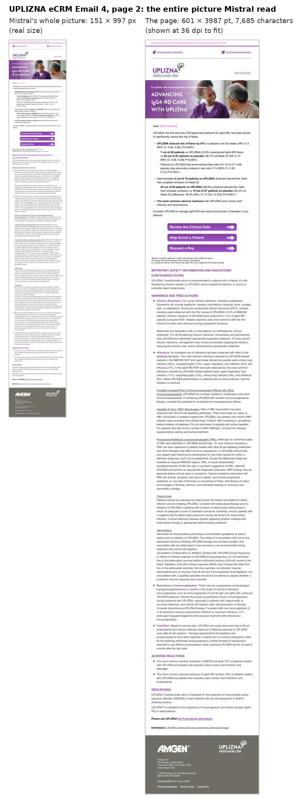
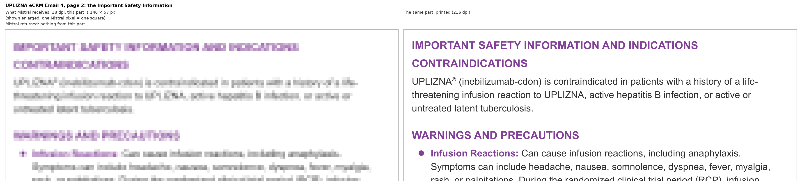
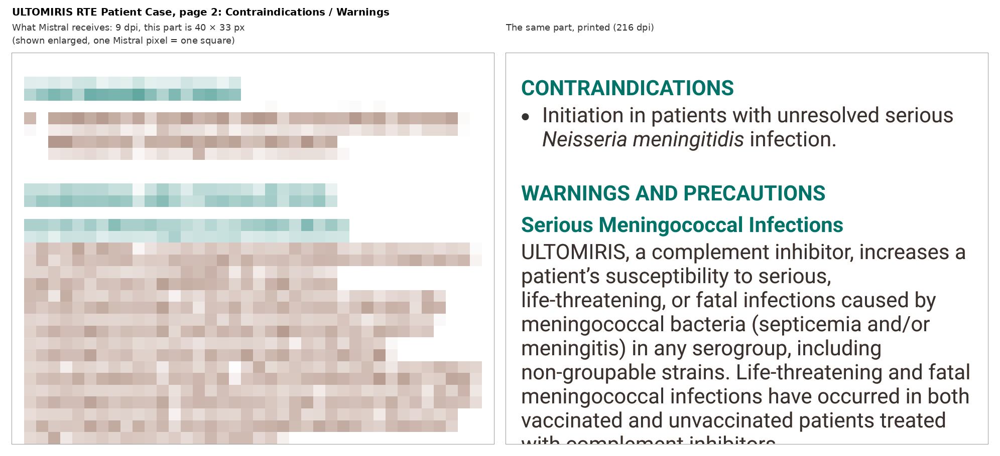
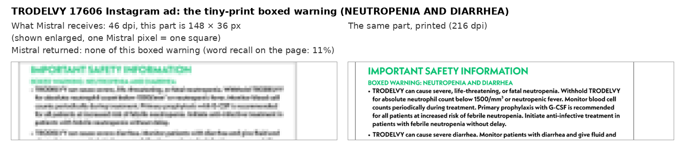
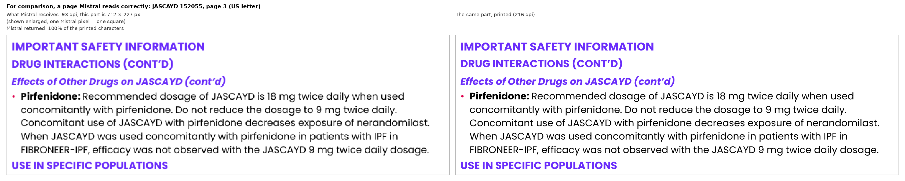

# Why Mistral OCR fails on our complex assets

Date: 9 Oct 2026. For the team and product management. Every number below was measured on our own
files and our own saved Mistral results; how to reproduce is in §10.

## 1. In one paragraph

Mistral never reads the PDF itself. It first turns each page into a **picture that is at most
about 1,024 pixels on its longest side**, whatever the page size, and reads that picture. For a
normal letter page this is fine: text comes out 13–15 pixels tall and Mistral reads it almost
perfectly. Our long marketing emails are 5–18 times taller than a letter page, so the same
1,024 pixels have to cover 5–18 times more page, and the text in the picture shrinks to **2–4
pixels**. No OCR can read letters that small. Mistral then returns very little, garbage, or text
it invented. **Neither Mistral's nor Azure's documentation says this.** We found it in
October, by reading the picture size Mistral reports back with every page.

- It is not a bug in our code, and it cannot be fixed by retrying, repairing or prompting: the
  detail is gone before Mistral starts reading.
- It decides by page shape and font size, so it is predictable: §4 shows the calculation, §9 the
  result for **every file in our asset dataset**. 24 of the 55 different files have at least one
  page Mistral cannot read, 15 more have pages it reads unreliably.
- Since 9 Oct, assets with very tall, wide, dense or picture-only pages skip Mistral and are read
  by LlamaParse. On the worst case below, LlamaParse returned 97% of the text where Mistral
  returned 0%.

## 2. What happened in September

When the complex long-page assets (marketing emails, rep-triggered emails, tall social posts)
reached us in September, Mistral's output for them was broken in ways that looked random:

- a page came back almost empty, or as a fragment of machine output. UPLIZNA eCRM Email 4, page 2
  returned only `# UPLIZING[{"box_2d": [640, 670` (28 characters) for a page that prints 7,685;
- a page came back with one line repeated hundreds of times (JASCAYD 151939, a 480 × 2,073 pt
  page: `call 1-800-555-2222 (6-800-555-2222)`, 269 times);
- tiny-print safety information was missing, or text was invented that is not on the page.

We treated these as Mistral glitches and built defences against the symptoms, one after another:

| Date | What we built | Why it could not solve this |
|---|---|---|
| 4 Sep | detection of repeated / broken output, re-OCR through the Mistral SDK, an AI repair agent (LangGraph) | re-OCR sends the same tiny picture again; the repair agent also only sees a page picture (≤ 2,048 px long side): on an 8,096 pt email that is 0.25 px per point, so 8 pt text is 2 px for it too |
| 5 Sep | guards so a bad OCR result is not reused | stops reuse of bad output, does not make the output good |
| 23 Sep | "advance OCR": every page through the repair agent | same limit as the repair agent |
| 28 Sep | LlamaParse as a fallback when Mistral's output is detected as broken | works, but only after Mistral, re-OCR and repair have run and been paid for, and only when the damage is detected |
| 9 Oct | **root cause found**; pages Mistral cannot read go straight to LlamaParse | – |

Together these September changes are about 1,650 lines in the OCR code alone. Each fixed a
symptom; none could fix the cause, because the cause was not known. That is why a large part of
September went into this.

**Why we did not know:** nothing in the documentation points to it (checked again on 9 Oct):

| Source | What it says | What it does not say |
|---|---|---|
| Mistral OCR API reference ([docs.mistral.ai/api/endpoint/ocr](https://docs.mistral.ai/api/endpoint/ocr)) | its example page comes back at **200 dpi, 1700 × 2200 px** (a letter page) | that the resolution drops for large pages. Our Azure deployment returns the same letter page at **93 dpi, 791 × 1023 px** |
| Mistral known limitations ([docs.mistral.ai/resources/known-limitations](https://docs.mistral.ai/resources/known-limitations)) | "Images are resized internally; very small images may lose detail" | to what size, or that large pages are shrunk |
| Azure model card, mistral-ocr-4-0 ([ai.azure.com/catalog/models/mistral-ocr-4-0](https://ai.azure.com/catalog/models/mistral-ocr-4-0)) | "Context window 128k", "Token limits 4096 output" | any image size, resolution or page-size limit |

## 3. The root cause, in plain words

Think of a photocopier that always prints on the same small card, about 1,024 dots on its long
edge, whatever you put on the glass.

- Put a letter page on the glass: it fits the card comfortably, every word is sharp.
- Put a 2-metre-long email printout on the glass: the copier shrinks the whole thing to fit the
  same card. Each line of text becomes a thin grey smear.

Mistral is that copier. It reads the card, not the original. How readable the card is depends
on only two things: **how long the page's longest side is** and **how big the font is**. Page
shape matters more than anything else: making a page taller does not give Mistral more pixels, it
spreads the same pixels thinner.

## 4. The calculation, with an example

**Example: UPLIZNA eCRM Email 4, page 2** (the page that came back as 28 characters).

| Step | Calculation | Result |
|---|---|---|
| 1. Page size (from the PDF; 72 points = 1 inch) | | 601 × 3,987 pt (8.3 × 55 inches) |
| 2. Mistral picks the resolution that keeps the long side at about 1,024 px | 1,024 × 72 ÷ 3,987 = 18.49, rounded down | **18 dpi** |
| 3. Size of the picture Mistral reads | 601 × 18 ÷ 72 and 3,987 × 18 ÷ 72 | **151 × 997 px** (Mistral reported exactly this) |
| 4. Text height in that picture | font 14 pt × 18 ÷ 72 | **3.5 px** |
| 5. Readable? | letters need about 8 px or more (§6) | **no**: Mistral returned 0% of the page |

**The same calculation for a normal page**: JASCAYD 152055, page 3, a US letter page.

| Step | Calculation | Result |
|---|---|---|
| 1. Page size | | 612 × 792 pt |
| 2. Resolution | 1,024 × 72 ÷ 792 = 93.1 | **93 dpi** |
| 3. Picture | | **791 × 1,023 px** |
| 4. Text height | 10 pt × 93 ÷ 72 | **12.9 px** |
| 5. Readable? | | **yes**: Mistral returned 100% of the page |

The rule in one line: **text height in Mistral's picture = font size × ⌊73,728 ÷ long side⌋ ÷
72** (all sizes in points; 73,728 = 1,024 × 72).

How sure is the rule? Every page Mistral has returned to us carries its picture size and dpi
(`dimensions` in the response). Across **67 different pages** from 14 files, including all the
examples in this report, the rule gives exactly the dpi Mistral used and the picture size to
within 1 pixel, every time. Whatever the page, the long side lands between 997 and 1,024 px.

## 5. What Mistral actually receives

Each picture below is rendered at **exactly the dpi Mistral used** for that page, so it has the
same pixels Mistral got. On the left, those pixels are shown enlarged, each one as a square
(nothing is added). On the right, the same part of the page at a size a person can read.
Mistral's own renderer may smooth edges slightly differently; the number of pixels, which is the
limit, is the same. Script: `docs/temp/mistral_failure/figures.py`.

**Figure 1. UPLIZNA eCRM Email 4, page 2: the entire picture Mistral read (left, real size)
for a page that prints 7,685 characters.**

**Figure 2. The safety information on that page.** 18 dpi; the text is 3.5 px tall. Mistral
returned none of it.

**Figure 3. ULTOMIRIS rep-triggered email, page 2** (320 × 7,788 pt): Mistral's whole page is
40 × 974 px, 9 dpi; the text is 1.8 px tall.

**Figure 4. TRODELVY 17606 Instagram ad**: not tall, but large (1,586 × 1,240 pt) with tiny
print (4.5–4.8 pt), so at 46 dpi the boxed warning is about 3 px tall. Mistral missed the boxed
warning entirely.

**Figure 5. For comparison, a letter page at 93 dpi**: 12.9 px text. Mistral read 100% of it.

## 6. Measured: text size against what Mistral returned

Our saved Mistral results, compared with the text actually printed on each page (the PDF's own
text). "Returned" is characters returned ÷ characters printed for app runs, and word recall
for the reader comparison of 8 Oct (`docs/temp/adobe_poc.md`).

| Page | Mistral's picture | Text height | Mistral returned |
|---|---|---|---|
| ULTOMIRIS RTE Patient Case, p2 | 40 × 974 px (9 dpi) | 1.8 px | not run here; predicted unreadable (and LlamaParse now reads it, 102%) |
| TRODELVY 17606, p1 | 1,014 × 793 px (46 dpi) | 3.1 px | **11%** of words; boxed warning missing |
| UPLIZNA eCRM Email 4, p2 | 151 × 997 px (18 dpi) | 3.5 px | **0%** (28 of 7,685 characters) |
| LIVDELZI 0449 (US-LIVP-0172), p2 | 660 × 1,020 px (60 dpi) | 4.2 px | **53%** of words, plus invented text |
| LIVDELZI 0449, p1 | 660 × 1,020 px (60 dpi) | 4.6 px | 79% of words |
| AIMOVIG ASC-43325, p1 | 544 × 1,023 px (32 dpi) | 5.1 px | **54%** |
| LIVDELZI 0519 / 0520, p3 (ISI) | 867 × 1,020 px (51 dpi) | 5.5 px | 84% / 70% of words |
| ULTOMIRIS US-ULT-P-0508, p2 | 672 × 1,008 px (28 dpi) | 6.2 px | 97% |
| REPATHA ASC-53141, p1 | 292 × 1,008 px (35 dpi) | 6.5 px | 101% |
| Old Asset - Copy, p2 / p3 | 1,024 × 768 px (36 dpi) | 7.5 / 7.8 px | 75% / 83% |
| 51 other pages (letter, slide, flashcard, CVA) | 452–1,024 px wide | **8 px or more** | 80–151%, median 100%; 45 of 51 at 90% or more |

So the three bands used in §9:

| Text height in Mistral's picture | Meaning | What we saw |
|---|---|---|
| **under 5 px** | **unreadable** | 0–79% returned, missing safety text, invented text |
| **5–8 px** | **unreliable** | anywhere from 54% to 107%: sometimes fine, sometimes a third lost |
| **8 px or more** | **readable** | 80–151%, median 100% |

(Over 100% usually means Mistral also read text inside images, which the PDF's own text does not
contain.)

## 7. Why this matters for the product

- **Safety text is the smallest print on the page.** ISI and boxed warnings are often in the
  smallest font, so they are the first text lost. That is exactly what our ISI validation and
  claim checks need.
- **The failure is silent.** Mistral does not report an error: it returns a successful response
  with less text, garbage, or invented words. Without a check, the asset looks processed.
- **Retrying and repairing cost money without helping.** Every extra pass sends the same
  shrunken picture.

## 8. What we do now

Since 9 Oct (`docs/developer_notes/asset_long_page_llamaparse.md`), every asset is checked
before OCR, for free, from the PDF itself. If any page is very tall or wide (≥ 9×), tall and
dense (≥ 5× and over 6,500 characters), tall and mostly picture, or a picture with no text, the
whole asset goes to **LlamaParse** and Mistral is never called.

| Page | Mistral | LlamaParse |
|---|---|---|
| UPLIZNA eCRM Email 4, p2 (601 × 3,987 pt) | 0% | **97%** |
| ULTOMIRIS RTE Patient Case, p1 / p2 | predicted unreadable (2.0 / 1.8 px) | **108% / 102%** |
| JASCAYD 146824, p1 (374 × 3,310 pt) | predicted unreadable (3.0 px) | **99%** |
| UPLIZNA 81553, p2 (600 × 4,523 pt) | predicted unreadable (4.0 px) | 50%: LlamaParse is better, not perfect |

Of the 10 test assets in the long-page and image-based groups, 9 now go to LlamaParse; the
tenth (LIVDELZI 0449) is a deliberate exception.

**Still open:** pages that are ordinary in shape but large with tiny print (social-media
artboards such as TRODELVY 17606, LIVDELZI 0532) are not caught by the shape rules, because
deciding by text size was not approved. They appear in §9 as "Mistral" with unreadable pages.

## 9. Every file in the asset dataset

All PDFs in `ASSET_dataset` (COMPLEX_ISI, NORMAL_ISI, PI_CLAIMS), 65 files, 55 different (the
rest are byte-identical copies, listed with "="). Annotations removed first, as the app does.
Sorted from worst to best.

- **Smallest typical text:** the page with the smallest median font size, in Mistral's picture.
- **Small print there:** the size the smallest 10% of that page's characters are at or below.
  Safety text is usually here, so it is the more honest number.
- **Unreadable / unreliable pages:** pages whose typical text is under 5 px / 5–8 px.
- **No text layer:** picture-only pages; their text size cannot be measured.
- **Read by now:** what the app does with the file today.

This is a prediction from the rule in §4, which matched every page Mistral returned to us; it is
not a Mistral run of every page.

| # | File | Pages | Smallest typical text (page) | Mistral's picture of that page | Small print there | Unreadable pages (< 5 px) | Unreliable pages (5–8 px) | No text layer | Read by now |
|---|---|---|---|---|---|---|---|---|---|
| 1 | LONG_PAGE / ULTOMIRIS Source File Rep-triggered Email template (RTE)- Patient Case | 2 | **1.8 px** (p2: 14.0 pt at 9 dpi) | 40 × 974 px of 320 × 7788 pt | 1.8 px | 1, 2 | – | – | LlamaParse (dense, p1) |
| 2 | LONG_PAGE / ULTOMIRIS Source File ULT gMG RTE (Email Template) - PK-PD | 2 | **1.8 px** (p2: 14.0 pt at 9 dpi) | 40 × 950 px of 320 × 7604 pt | 1.8 px | 1, 2 | – | – | LlamaParse (dense, p1) |
| 3 | COMPLEX_ISI / BKEMV Manuscript MU  ASC-55846 REMS Transactional Rep Triggered Email | 6 | **2.2 px** (p1: 5.5 pt at 29 dpi) | 483 × 1015 px of 1200 × 2520 pt | 1.6 px | 1, 4 | 5, 6 | – | Mistral |
| 4 | SOCIAL_MEDIA / LIVDELZI Gilead US-LIVP-0532 Source file (= SOCIAL_MEDIA / LIVDELZI US-LIVP-0532 Source file) | 5 | **2.2 px** (p4: 10.0 pt at 16 dpi) | 973 × 450 px of 4379 × 2027 pt | 2.2 px | 1–5 | – | – | Mistral |
| 5 | NORMAL_ISI / LIVDELZI US-LIVP-0557  Source file | 2 | **2.3 px** (p2: 6.0 pt at 28 dpi) | 485 × 1003 px of 1248 × 2580 pt | 2.3 px | 2 | 1 | – | Mistral |
| 6 | IMAGE_BASED / ULTOMIRIS US-ULT-g-0411  Source File Reactive RTE- TV Spot | 2 | **2.4 px** (p2: 5.2 pt at 33 dpi) | 138 × 1021 px of 300 × 2227 pt | 2.3 px | 1, 2 | – | – | LlamaParse (picture, p1) |
| 7 | IMAGE_BASED / BREZTRI US-109874 RTE  Clean Source file | 10 | **2.7 px** (p3: 12.0 pt at 16 dpi) | 116 × 990 px of 520 × 4456 pt | 2.4 px | 1–8 | 10 | – | LlamaParse (picture, p1) |
| 8 | COMPLEX_ISI / UPLIZNA UPLIZNA-ASC-56441-USA-335-81773-UPLIZNA IgG4-RD Branded RTE -  | 11 | **2.7 px** (p1: 12.0 pt at 16 dpi) | 384 × 986 px of 1728 × 4437 pt | 2.0 px | 1, 3 | 4, 5 | – | Mistral |
| 9 | IMAGE_BASED / JASCAYD PC-US-146824 Jardiance Heritage VAE Card Q1 2026 | 2 | **3.0 px** (p1: 10.0 pt at 22 dpi) | 114 × 1011 px of 374 × 3310 pt | 2.5 px | 1 | – | 2 | LlamaParse (dense, p1) |
| 10 | SOCIAL_MEDIA / TRODELVY 17606 TRODELVY First TROP-2 IG Ad Digital (Source file) | 1 | **3.1 px** (p1: 4.8 pt at 46 dpi) | 1013 × 792 px of 1586 × 1240 pt | 2.9 px | 1 | – | – | Mistral |
| 11 | SOCIAL_MEDIA / TRODELVY 17618 TRODELVY DiseaseIndication Awareness IG (HR+) Retargeti | 1 | **3.1 px** (p1: 4.8 pt at 46 dpi) | 1013 × 827 px of 1586 × 1295 pt | 2.9 px | 1 | – | – | Mistral |
| 12 | LONG_PAGE / LIVDELZI US-LIVP-0460 Source file (= NORMAL_ISI / LIVDELZI 11. US-LIVP-0460 - Asset file) | 5 | **3.3 px** (p4: 16.8 pt at 14 dpi) | 105 × 1007 px of 540 × 5179 pt | 2.5 px | 2, 4 | – | – | LlamaParse (dense, p2) |
| 13 | SOCIAL_MEDIA / LIVDELZI Gilead US-LIVP-0523 Source file | 8 | **3.4 px** (p5: 35.0 pt at 7 dpi) | 833 × 899 px of 8570 × 9242 pt | 3.4 px | 5–8 | 3 | – | Mistral |
| 14 | NORMAL_ISI / UPLIZNA Content Input Uplizna ASC-56324 UPZ IgG4-RD HCP Branded - eCRM | 2 | **3.5 px** (p2: 14.0 pt at 18 dpi) | 150 × 997 px of 601 × 3987 pt | 3.5 px | 2 | – | – | LlamaParse (dense, p2) |
| 15 | LONG_PAGE / UPLIZNA UPZ USA-335-81743 ASC-56321 IgG4-RD HCP Branded - eCRM Email 1 | 2 | **3.7 px** (p2: 14.0 pt at 19 dpi) | 159 × 1004 px of 601 × 3803 pt | 3.7 px | 2 | – | – | LlamaParse (dense, p2) |
| 16 | NORMAL_ISI / UPLIZNA Uplizna 56322 USA-335-81744 UPZ IgG4-RD HCP Branded eCRM Email | 2 | **3.7 px** (p2: 14.0 pt at 19 dpi) | 159 × 981 px of 602 × 3716 pt | 3.7 px | 2 | – | – | LlamaParse (dense, p2) |
| 17 | SOCIAL_MEDIA / LIVDELZI Gilead US-LIVP-0495 Source File | 3 | **3.9 px** (p3: 35.0 pt at 8 dpi) | 952 × 1009 px of 8570 × 9080 pt | 3.9 px | 3 | 1, 2 | – | Mistral |
| 18 | LONG_PAGE / UPLIZNA UPLIZNA-ASC-56443-USA-335-81553-UPLIZNA eCRM 3 Segment 2 On Ot | 2 | **4.0 px** (p2: 18.0 pt at 16 dpi) | 133 × 1005 px of 600 × 4523 pt | 4.0 px | 2 | – | – | LlamaParse (dense, p2) |
| 19 | NORMAL_ISI / BREZTRI US-109911 iCVA  US-105599 source file | 33 | **4.0 px** (p1: 11.0 pt at 26 dpi) | 986 × 739 px of 2732 × 2048 pt | 4.0 px | 1–7, 10, 15, 17, 18, 20, 25–27, 30, 31 | – | – | Mistral |
| 20 | LONG_PAGE / LIVDELZI gilead US-LIVP-0449 Source file | 2 | **4.2 px** (p2: 5.1 pt at 60 dpi) | 660 × 1020 px of 792 × 1224 pt | 2.7 px | 1, 2 | – | – | Mistral |
| 21 | NORMAL_ISI / UPLIZNA ASC-57881  Initial File | 2 | **4.3 px** (p1: 24.0 pt at 13 dpi) | 231 × 995 px of 1280 × 5509 pt | 4.3 px | 1 | – | – | Mistral |
| 22 | SOCIAL_MEDIA / TRODELVY 17619 TRODELVY HR+ Efficacy OS FB Ad Digital (Source file) | 2 | **4.7 px** (p2: 7.8 pt at 44 dpi) | 1008 × 550 px of 1650 × 900 pt | 4.5 px | 2 | 1 | – | Mistral |
| 23 | NORMAL_ISI / REPATHA Content Input Repatha ASC-56475 Repatha Congress Template Bran | 1 | **4.7 px** (p1: 11.0 pt at 31 dpi) | 258 × 1016 px of 600 × 2360 pt | 4.3 px | 1 | – | – | Mistral |
| 24 | PI_CLAIMS / Old Asset | 73 | **4.7 px** (p50: 11.2 pt at 30 dpi) | 995 × 695 px of 2388 × 1668 pt | 3.0 px | 50 | 51–62 | – | Mistral |
| 25 | NORMAL_ISI / BLINCYTO SPONSOR MU-ASC-45663-USA-103-81905 (= PI_CLAIMS / SPONSOR MU-ASC-45663-USA-103-81905) | 36 | **5.0 px** (p2: 9.9 pt at 36 dpi) | 1008 × 396 px of 2016 × 792 pt | 3.3 px | – | 1–3, 5–17, 20, 21, 26, 28, 29 | – | Mistral |
| 26 | NORMAL_ISI / AIMOVIG SPONSOR MU-ASC-43325 (= PI_CLAIMS / SPONSOR MU-ASC-43325) | 4 | **5.1 px** (p1: 11.5 pt at 32 dpi) | 544 × 1022 px of 1224 × 2300 pt | 3.9 px | – | 1, 2 | – | Mistral |
| 27 | NORMAL_ISI / JASCAYD 4. PC-US-151939 - Source file 1 | 1 | **5.1 px** (p1: 10.5 pt at 35 dpi) | 233 × 1008 px of 480 × 2073 pt | 4.4 px | – | 1 | – | Mistral |
| 28 | SOCIAL_MEDIA / TRODELVY 17749 TRODELVY HCP Banner Ads  DiseaseIndication Awareness (H | 8 | **5.4 px** (p3: 12.6 pt at 31 dpi) | 1012 × 341 px of 2350 × 792 pt | 4.7 px | – | 3 | – | Mistral |
| 29 | SOCIAL_MEDIA / LIVDELZI US-LIVP-0519  Source file | 3 | **5.5 px** (p3: 7.7 pt at 51 dpi) | 867 × 1020 px of 1224 × 1440 pt | 5.0 px | – | 3 | – | Mistral |
| 30 | SOCIAL_MEDIA / LIVDELZI US-LIVP-0520 Source file (= SOCIAL_MEDIA / LIVDELZI US-LIVP-0520  Source file) | 3 | **5.5 px** (p3: 7.7 pt at 51 dpi) | 867 × 1020 px of 1224 × 1440 pt | 5.0 px | – | 3 | – | Mistral |
| 31 | NORMAL_ISI / UPLIZNA Uplizna 56335 USA-335-81756  UPZ IgG4-RD Branded - Social Post | 5 | **5.7 px** (p5: 24.0 pt at 17 dpi) | 615 × 992 px of 2604 × 4203 pt | 5.7 px | – | 4, 5 | – | Mistral |
| 32 | PI_CLAIMS / PC-QA-100382 Previous version | 1 | **5.9 px** (p1: 25.0 pt at 17 dpi) | 1020 × 769 px of 4322 × 3256 pt | 5.9 px | – | 1 | – | Mistral |
| 33 | SOCIAL_MEDIA / TRODELVY 17659 TRODELVY AE Management LinkedIn Ad Digital March 2025 L | 5 | **6.0 px** (p4: 6.8 pt at 64 dpi) | 1024 × 576 px of 1152 × 648 pt | 5.7 px | – | 1–4 | – | Mistral |
| 34 | PI_CLAIMS / PC-IN-105178 Previous version | 20 | **6.0 px** (p2: 12.0 pt at 36 dpi) | 1024 × 768 px of 2048 × 1536 pt | 6.0 px | – | 2, 5–13, 15–19 | – | Mistral |
| 35 | PI_CLAIMS / PC-SA-102894 Previous version | 1 | **6.0 px** (p1: 6.0 pt at 72 dpi) | 595 × 1017 px of 595 × 1017 pt | 6.0 px | – | 1 | – | Mistral |
| 36 | NORMAL_ISI / ULTOMIRIS 3. US-ULT-P-0508 - Source File 1 | 2 | **6.2 px** (p2: 16.0 pt at 28 dpi) | 672 × 1008 px of 1728 × 2592 pt | 6.2 px | – | 2 | – | Mistral |
| 37 | PI_CLAIMS / EM-IN-100215 Previous version | 51 | **6.2 px** (p13: 8.0 pt at 56 dpi) | 471 × 1022 px of 606 × 1314 pt | 6.2 px | – | 13, 14, 25, 26, 36, 48, 49 | 1–3 | LlamaParse (image, p1) |
| 38 | NORMAL_ISI / REPATHA Content Input Repatha ASC-53141 USA-CCF-83489 Repatha SFMC Pos (= PI_CLAIMS / Content Input Repatha ASC-53141 USA-CCF-83489 Repatha SFMC Post-Speake) | 1 | **6.5 px** (p1: 13.3 pt at 35 dpi) | 292 × 1008 px of 600 × 2074 pt | 6.5 px | – | 1 | – | Mistral |
| 39 | PI_CLAIMS / Old Asset - Copy | 8 | **7.5 px** (p2: 15.1 pt at 36 dpi) | 1024 × 768 px of 2048 × 1536 pt | 6.1 px | – | 2, 3 | – | Mistral |
| 40 | NORMAL_ISI / ULTOMIRIS US-ULT-g-0369  Source File ULTOMIRIS gMG-NMOSD Dosing & Meni | 4 | **8.1 px** (p3: 10.0 pt at 58 dpi) | 1015 × 682 px of 1260 × 846 pt | 6.4 px | – | – | – | Mistral |
| 41 | SOCIAL_MEDIA / IMDELLTRA Initial Clean PDF  ASC 57564 | 10 | **8.3 px** (p2: 6.4 pt at 93 dpi) | 1023 × 790 px of 792 × 612 pt | 5.0 px | – | – | – | Mistral |
| 42 | NORMAL_ISI / PROLIA SPONSOR MU ASC-45838 USA-785-82837 (= PI_CLAIMS / SPONSOR MU ASC-45838 USA-785-82837) | 37 | **9.0 px** (p3: 18.0 pt at 36 dpi) | 1024 × 768 px of 2048 × 1536 pt | 9.0 px | – | – | – | Mistral |
| 43 | NORMAL_ISI / UPLIZNA ASC-59041-USA-335-82122-UPLIZNA gMG Infusion Guide Content MU  | 11 | **9.3 px** (p3: 12.0 pt at 56 dpi) | 1008 × 616 px of 1296 × 792 pt | 7.8 px | – | – | – | Mistral |
| 44 | NORMAL_ISI / PROLIA VIETNAMESE  SPONSOR MU ASC-47715 USA-162-83704 (= PI_CLAIMS / SPONSOR MU ASC-47715 USA-162-83704) | 19 | **10.0 px** (p13: 10.0 pt at 72 dpi) | 1024 × 768 px of 1024 × 768 pt | 10.0 px | – | – | – | Mistral |
| 45 | NORMAL_ISI / ULTOMIRIS ULTOMIRIS NMOSD HCP CVA Slim Jim | 11 | **10.3 px** (p10: 8.0 pt at 93 dpi) | 1023 × 976 px of 792 × 756 pt | 10.3 px | – | – | – | Mistral |
| 46 | PI_CLAIMS / PC-QA-100381 previous version (= PI_CLAIMS / PC-SA-102921 BannerAd Previous version) | 4 | **10.4 px** (p1: 11.0 pt at 68 dpi) | 1020 × 952 px of 1080 × 1008 pt | 10.4 px | – | – | – | Mistral |
| 47 | NORMAL_ISI / PROLIA PROLIA-ASC-45624-USA-162-83678-KAM Prolia Clinical Flashcard co | 3 | **10.6 px** (p1: 9.0 pt at 85 dpi) | 765 × 1020 px of 648 × 864 pt | 9.4 px | – | – | – | Mistral |
| 48 | NORMAL_ISI / WEZLANA SOURCE-MU ASC-43319 USA-654-80053 (= PI_CLAIMS / SOURCE-MU ASC-43319 USA-654-80053) | 16 | **10.7 px** (p3: 21.4 pt at 36 dpi) | 1024 × 768 px of 2048 × 1536 pt | 8.0 px | – | – | – | Mistral |
| 49 | PI_CLAIMS / ASC-23836 USA-678-80197 IMLYGIC Hospital Outpatient Billing Guide | 5 | **11.6 px** (p2: 9.0 pt at 93 dpi) | 790 × 1023 px of 612 × 792 pt | 9.7 px | – | – | – | Mistral |
| 50 | NORMAL_ISI / JASCAYD 7. PC-US-152055 - Source file 1 | 4 | **12.9 px** (p3: 10.0 pt at 93 dpi) | 790 × 1023 px of 612 × 792 pt | 11.6 px | – | – | – | Mistral |
| 51 | NORMAL_ISI / JASCAYD 7. PC-US-152055 - Source file 2 | 4 | **12.9 px** (p3: 10.0 pt at 93 dpi) | 790 × 1023 px of 612 × 792 pt | 11.6 px | – | – | – | Mistral |
| 52 | PI_CLAIMS / ASC-24059 USA-678-80200 IMLYGIC Product Ordering Guide | 3 | **12.9 px** (p1: 10.0 pt at 93 dpi) | 790 × 1023 px of 612 × 792 pt | 12.9 px | – | – | – | Mistral |
| 53 | PI_CLAIMS / PC-IQ-100167 Previous version | 17 | **13.3 px** (p9: 9.4 pt at 102 dpi) | 1020 × 765 px of 720 × 540 pt | 11.4 px | – | – | – | Mistral |
| 54 | PI_CLAIMS / PC-LB-101349 Previous version | 17 | **13.3 px** (p9: 9.4 pt at 102 dpi) | 1020 × 765 px of 720 × 540 pt | 11.4 px | – | – | – | Mistral |
| 55 | IMAGE_BASED / JASCAYD 4. PC-US-151939 - Source file 2 | 1 | – | – | – | – | – | 1 | LlamaParse (image, p1) |

Files by their smallest page: unreadable 24, unreliable 15, readable 15, no text layer at all 1; 496 pages in 55 unique files (10 more files are byte-identical copies).

## 10. Limits of this analysis

- **Font size is a proxy.** It comes from the PDF's text layer. Text inside images has no font
  size, and a page with a few big headings and much small print shows a larger median than its
  small print (that is why the small-print column is there).
- **The 8 px / 5 px bands come from 67 measured pages**, most of them readable. The bands are
  clear at the extremes; the 5–8 px band is genuinely mixed.
- **The 4,096-token output limit** on Azure's model card is real, but our data does not show it
  as a hard per-page cut-off (one page came back with about 5,900 tokens). The size of the
  picture is what explains the failures above; the token limit may add to it on very dense pages.
- Mistral can change its rendering at any time; the `dimensions` it returns per page will show it.

## 11. Sources and how to reproduce

| What | Where |
|---|---|
| Measure every page of the dataset (writes `pages.json`) | from `label/`: `PYTHONPATH=. ../.venv/bin/python ../docs/temp/mistral_failure/measure.py` |
| The table in §9 | `../.venv/bin/python ../docs/temp/mistral_failure/tables.py > ../docs/temp/mistral_failure/tables.md` |
| Figures 1–5 | `../.venv/bin/python ../docs/temp/mistral_failure/figures.py` |
| Saved Mistral responses (picture size per page) | `label/data/Asset/*/raw_json/chunk_*_azure_mistral_ocr4.json`, `docs/temp/adobe/*/mistral_ocr4/response.json` |
| Reader comparison (word recall, invented text) | `docs/temp/adobe_poc.md` |
| Long-page routing (what we do now) | `docs/developer_notes/asset_long_page_llamaparse.md`, `docs/temp/R3-QA-bugs.md` |
| Documentation checked | [Mistral OCR API](https://docs.mistral.ai/api/endpoint/ocr), [Mistral known limitations](https://docs.mistral.ai/resources/known-limitations), [Azure mistral-ocr-4-0 model card](https://ai.azure.com/catalog/models/mistral-ocr-4-0) |
