# Mistral OCR Playground — PDF Visual Viewer
## Complete Reverse-Engineering Report & Implementation Guide

> **What this is.** A forensic teardown of how Mistral AI Studio's Document AI / OCR
> playground renders a PDF with OCR bounding-box overlays, followed by a working,
> numerically-verified reproduction and a guide to integrating the same capability into
> a production application.
>
> **The headline.** The overlay is not SVG, not canvas, and not a PDF.js layer. It is a
> flat list of absolutely-positioned `<div>`s in a `pointer-events:none` container that
> sits as a **sibling** of the PDF page. Coordinates map by a **pure per-axis
> proportional scale** with no rotation, no Y-flip and no offsets. Verified against the
> live application to **0.000050 px** across 106 regions.

| | |
|---|---|
| **Target** | `https://console.mistral.ai/build/document-ai/ocr-playground` |
| **Investigated** | 2026-09-08 |
| **App build** | `2026.9.8-main-38760-4616289` |
| **Their PDF.js** | 5.4.296 (build `f56dc8601`) via `react-pdf` |
| **Their SDK** | `mistral-client-typescript/1.22.1` (Speakeasy-generated) |
| **Capture env** | Chrome 151, Linux/WSLg, viewport 1908×832, **devicePixelRatio 1** |
| **Clone** | `clone/` — React 19 + TypeScript + `pdfjs-dist` 6.3.289 |
| **Verification** | 16 unit assertions + 14 Playwright tests, all passing |

**Confidence labels used throughout.** Every non-obvious claim carries one:

| Label | Meaning |
|---|---|
| **[SRC]** | Read directly out of Mistral's production JavaScript |
| **[MEAS]** | Measured in the running application |
| **[SRC+MEAS]** | Read from source *and* independently confirmed by measurement |
| **[HYP]** | Hypothesis, with sample size stated — not proven |

---

# Index

**Part I — Orientation**
1. [The problem](#1-the-problem)
2. [Executive summary: the eight facts that matter](#2-executive-summary-the-eight-facts-that-matter)
3. [Glossary](#3-glossary)

**Part II — How the investigation was done**
4. [Tooling and environment](#4-tooling-and-environment)
5. [Method, phase by phase](#5-method-phase-by-phase)
6. [The network interceptor](#6-the-network-interceptor)
7. [Reading minified code without source maps](#7-reading-minified-code-without-source-maps)

**Part III — What Mistral actually is**
8. [System architecture](#8-system-architecture)
9. [The request/response cycle](#9-the-requestresponse-cycle)
10. [Anatomy of the OCR JSON](#10-anatomy-of-the-ocr-json)

**Part IV — The heart of it: coordinates**
11. [Three coordinate spaces](#11-three-coordinate-spaces)
12. [The raster space and how it is derived](#12-the-raster-space-and-how-it-is-derived)
13. [The exact transform](#13-the-exact-transform)
14. [Proving X and Y are independent](#14-proving-x-and-y-are-independent)
15. [Sub-pixel truth: the 1/64 px floor](#15-sub-pixel-truth-the-164-px-floor)

**Part V — How it displays**
16. [The DOM tree](#16-the-dom-tree)
17. [The overlay implementation](#17-the-overlay-implementation)
18. [Colour system](#18-colour-system)
19. [Labels](#19-labels)

**Part VI — Behaviour**
20. [Zoom](#20-zoom)
21. [Scroll and page tracking](#21-scroll-and-page-tracking)
22. [Hover, selection and synchronisation](#22-hover-selection-and-synchronisation)
23. [Images](#23-images)

**Part VII — Building it**
24. [Clone architecture](#24-clone-architecture)
25. [The code, module by module](#25-the-code-module-by-module)
26. [Testing strategy](#26-testing-strategy)
27. [Reproducing the demo](#27-reproducing-the-demo)

**Part VIII — Production integration**
28. [Integration guide for a frontend developer](#28-integration-guide-for-a-frontend-developer)
29. [Minimal viable implementation (60 lines)](#29-minimal-viable-implementation-60-lines)
30. [Framework variants](#30-framework-variants)
31. [Performance at scale](#31-performance-at-scale)
32. [Pitfalls and how to avoid them](#32-pitfalls-and-how-to-avoid-them)

**Part IX — Reference**
33. [Verification results](#33-verification-results)
34. [Differences between clone and original](#34-differences-between-clone-and-original)
35. [What remains unverified](#35-what-remains-unverified)
36. [Artifact index](#36-artifact-index)

---

# Part I — Orientation

## 1. The problem

You have two things:

1. **A PDF.**
2. **An OCR JSON** describing that PDF: per page, a list of *blocks*, each with a
   bounding box in integer pixels, a type (`text`, `title`, `table`, `image`, …) and
   its extracted content.

You want what Mistral's playground shows: the PDF rendered faithfully, with every OCR
block drawn as a labelled, colour-coded rectangle sitting exactly on top of the content
it describes — surviving zoom, scroll, multi-page documents and pages of differing
physical size.

The hard part is **not** rendering the PDF; PDF.js does that. The hard part is the
coordinate mapping, because there are three different coordinate systems in play and
the OCR JSON is expressed in none of the ones the browser understands:

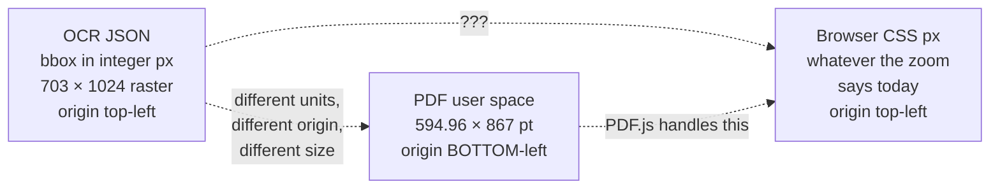

Get that mapping wrong by a fraction and every box drifts — subtly at 25 % zoom,
grossly at 400 %. Get the axis convention wrong and boxes appear mirrored vertically.
Assume a single shared scale factor and pages whose aspect ratio differs from their
raster's will be wrong on one axis only, which is the most confusing failure mode of
all because *most* of the page looks fine.

This document establishes the mapping empirically, to sub-pixel precision, and then
builds it.

## 2. Executive summary: the eight facts that matter

If you read nothing else:

**① The overlay is plain HTML divs.** Absolutely positioned inside a
`pointer-events:none` container. Not SVG. Not canvas. Not PDF.js's annotation or text
layer. **[SRC+MEAS]**

**② The overlay is a *sibling* of the PDF page, not a child.** Both live inside an
application-owned wrapper. The overlay therefore never touches a PDF.js-managed
subtree, which is why it survives PDF.js re-renders. **[MEAS]**

**③ The transform is a pure per-axis proportional scale.**

```
left = topLeftX / rasterWidth  × renderedPageWidth
top  = topLeftY / rasterHeight × renderedPageHeight
```

No Y inversion. No rotation. No CropBox term. No viewport offset. No scroll offset. No
devicePixelRatio. No CSS transform. Each absence was checked against source. **[SRC+MEAS]**

**④ X and Y scale independently.** They use *their own* axis ratio. Models reusing one
axis's ratio for both were rejected at 11–14× the measurement noise. **[MEAS]**

**⑤ The boxes are display-only.** Zero event handlers. Synchronisation is
**one-directional: right panel → PDF**. Clicking a bbox does nothing. **[SRC+MEAS]**

**⑥ `devicePixelRatio` never touches box placement.** It appears in exactly one place:
the maximum-zoom cap that guards the browser's canvas size limit. **[SRC]**

**⑦ The OCR raster is a rendering of the page at a per-page DPI**, chosen so the long
side lands at ≤ 1024 px. `dimensions.width = ceil(pdfPtWidth × dpi / 72)`. **[MEAS, 5 samples]**

**⑧ `image_base64` is a complete `data:` URI.** Use it verbatim as ``; do not
prefix it. **[MEAS]**

## 3. Glossary

| Term | Meaning |
|---|---|
| **bbox / bounds** | `top_left_x, top_left_y, bottom_right_x, bottom_right_y` — integer pixels in the OCR raster space |
| **block** | One OCR-detected region: a bbox + a type + its text content |
| **region** | The frontend's view-model wrapper around a block: adds an `id`, a label and a colour |
| **raster space** | The pixel grid the OCR engine worked in, given by `page.dimensions` |
| **native size** | `pdfPage.getViewport({scale: 1}).width/height` — the page's CSS-pixel size at 100 % |
| **rendered size** | `native × scale` — the page's actual on-screen size |
| **scale** | `zoomPercent / 100`. A plain float; never quantised |
| **kx / ky** | The per-axis coordinate scales, `native / raster` on each axis |
| **LayoutUnit** | Blink's internal 1/64 px layout granularity — the floor on measurement precision |
| **CropBox** | The PDF rectangle actually displayed; may be smaller than the MediaBox |
| **MediaBox** | The PDF page's full physical rectangle |

---

# Part II — How the investigation was done

## 4. Tooling and environment

| Tool | Role |
|---|---|
| **Chrome DevTools MCP** (`chrome-devtools-mcp@1.8.0`) | Drove a real headful Chrome over CDP: navigation, clicks, uploads, screenshots, `evaluate_script`, network log, console |
| **Chrome 151.0.7922.173** | The browser. Persistent profile at `~/.cache/chrome-devtools-mcp/chrome-profile`, which is what carried the authenticated session |
| **WSLg (`DISPLAY=:0`)** | Gave the automated Chrome a real X display, so the app rendered exactly as a human would see it |
| `curl` | Bulk-downloading the 110 JavaScript chunks; probing the auth redirect chain |
| `js-beautify@1` | Turning minified chunks into greppable, readable code |
| `pdfinfo`, `pdftoppm` (poppler) | Ground-truth PDF page sizes; rasterising a page to build a test fixture |
| Hand-written PDF generator (Python, ~40 lines) | Building a fixture with a JPEG at a **known** rectangle — the decisive image test |
| **Vitest** | Unit-testing the pure transform against measured ground truth |
| **Playwright** | Geometry-parity and behaviour tests against the clone |
| Python | All measurement analysis, model fitting, artifact generation |

**A note on why a real browser mattered.** Almost every important fact here —
`kx ≠ ky`, the 1/64 px floor, the unfloored-overlay-vs-floored-canvas drift, the exact
label offset of 3 px rather than 2 px — is only visible by measuring
`getBoundingClientRect()` in a live layout. Static source reading alone would have got
the *form* of the transform right and the *details* wrong.

## 5. Method, phase by phase

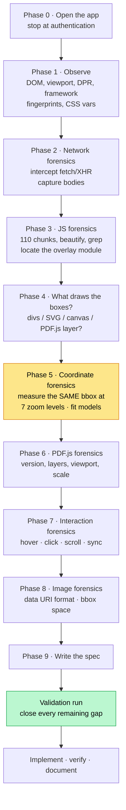

The two shaded phases carried the weight. Phase 5 established the transform; the
validation run proved the parts that source-reading alone left ambiguous.

**A sequencing lesson worth stealing.** The instrumentation went in *before* asking the
human operator to click `Run`. They clicked immediately — and the OCR request was
captured only because the interceptor was already armed. Instrument first, then prompt.

### Phase-by-phase yield

| Phase | Key output |
|---|---|
| 1 | Next.js App Router + Turbopack, Tailwind v4, `window.pdfjsLib` = **5.4.296**, `react-pdf` class names, **DPR 1** |
| 2 | Endpoint is a console proxy `POST /api-ui/quota/v1/ocr`; request body; full response bodies |
| 3 | `DetectedRegionOverlay` located in Turbopack module **276369**; region builders; TipTap sync plugin; source maps declared but **404** |
| 4 | **Absolutely-positioned divs**; overlay is a *sibling*; `pointer-events:none`; zero handlers |
| 5 | Transform proven; 7-zoom sweep at **0.000000 px** error on ladder zooms |
| 6 | Text layer on, annotation layer on-but-empty, no editor layer, no rotation control |
| 7 | Hover/click sync one-directional; `scrollToRegion` formula verified (predicted 2114, measured 2114) |
| 8 | `image_base64` is a full data URI; image bbox shares the text-block space |

## 6. The network interceptor

The browser's own network log gives headers and timings but is awkward for large JSON
bodies. Monkey-patching `fetch` and `XMLHttpRequest` gives parsed bodies directly:

```js
// Installed via CDP before any user action.
const rec = { log: [] };
window.__mrec = rec;

const origFetch = window.fetch;
window.fetch = async function (input, init) {
  const url = typeof input === 'string' ? input : input?.url ?? String(input);
  const entry = { url, method: init?.method ?? 'GET', t0: performance.now() };

  // ... capture request headers/body, redacting authorization/cookie/api-key ...

  const res = await origFetch.apply(this, arguments);
  entry.status = res.status;
  entry.ms = performance.now() - entry.t0;

  if (/\/v1\/(ocr|files)/i.test(url)) {
    // clone() so the app still gets to read the body
    entry.resBody = await res.clone().text();
  }
  rec.log.push(entry);
  return res;
};
```

**The gotcha that cost one run.** Mistral's Speakeasy-generated SDK calls
`fetch(new Request(url, {...}))` — a single `Request` argument, with the body *on the
Request object*, so `init.body` is `undefined`. The first-generation interceptor logged
a `null` request body. The fix:

```js
if (input && typeof input !== 'string' && typeof input.clone === 'function') {
  const c = input.clone();
  captured = { url: c.url, method: c.method, body: await c.text() };
}
```

Always clone the `Request`, not just inspect `init`.

**Redaction.** Telemetry payloads carried personal data and the OCR request carried a
signed Azure SAS URL (a credential). Both were redacted in the stored artifacts, keeping
only the parts with forensic value.

## 7. Reading minified code without source maps

All 109 chunks declared `//# sourceMappingURL=<chunk>.js.map`. Every one returned
**HTTP 404** — standard production hardening. So identifiers are minified and only
these survive:

- **object keys** — `topLeftX`, `colorScheme`, `originalPageWidth`
- **string literals** — `"pointer-events-none absolute top-0 left-0"`
- **React prop names** — `detectedRegions`, `hoveredRegionId`, `scrollToPdfRegionRef`
- **CSS class strings** — the entire Tailwind class list, which is enormously revealing
- **i18n keys** — `Ocr.review.visual.blockLabel`

The workflow that found the overlay in about ten minutes:

```bash
# 1. Harvest every chunk the page loaded
cat chunk-urls.txt | xargs -P 12 -I{} sh -c 'curl -sS -o chunks/$(basename {}) {}'

# 2. Grep for domain vocabulary. The OCR wire format uses snake_case;
#    the frontend remaps to camelCase -- so grep BOTH.
grep -l "top_left_x"  chunks/*     # -> the SDK chunk (Zod schemas)
grep -c "topLeftX"    chunks/*     # -> the UI chunks that do arithmetic

# 3. Beautify only the interesting ones
npx js-beautify -f chunks/1ingfc0dby6lt.js -o pretty/1ingfc0dby6lt.js

# 4. Grep the pretty version for structure
grep -n "DetectedRegionOverlay\|originalPageWidth\|colorScheme" pretty/*.js
```

**The single most useful trick:** grep for *Tailwind class strings*. A line containing
`"pointer-events-none absolute top-0 left-0"` is the overlay container, unambiguously,
even though every surrounding identifier is a single letter.

**Second most useful:** React's fiber internals give you live props.

```js
const key = Object.keys(el).find(k => k.startsWith('__reactFiber$'));
let f = el[key];
for (let i = 0; i < 40 && f; i++) {
  if (f.memoizedProps?.detectedRegions) return f.memoizedProps;  // ← ground truth
  f = f.return;
}
```

That one snippet turned "I think this is the scale" into
`scale: 0.39, pageWidth: 2048, pageHeight: 1536` — the actual prop values, straight from
the component. And
`__reactProps$` on a box element proved the *absence* of handlers, which is a claim you
cannot make from reading minified code.

**Third:** to recover a design system's real colour values, inject probe elements
carrying the token classes and read `getComputedStyle`. This produced the exact 13-scheme
palette without guessing a single hex value.

```js
const el = document.createElement('div');
el.className = 'bg-badge-pinkdeep border-basic-pinkdeep-strong border';
document.body.appendChild(el);
getComputedStyle(el).backgroundColor;  // "rgba(225, 125, 210, 0.1)"
```

---

# Part III — What Mistral actually is

## 8. System architecture

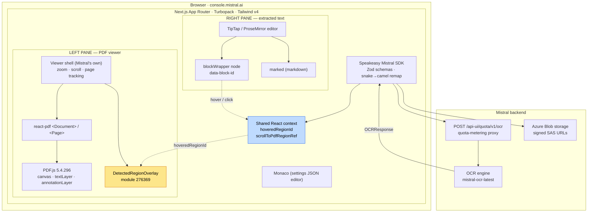

### The stack, itemised

| Layer | Technology | How we know |
|---|---|---|
| Framework | **Next.js App Router**, Turbopack | `window.__next_f` present, no `#__NEXT_DATA__`, chunk `turbopack-*.js` **[MEAS]** |
| Styling | **Tailwind CSS v4** | body class `font-(family-name:--font-inter)` — v4 arbitrary-property syntax **[MEAS]** |
| PDF render | **`react-pdf`** wrapping **PDF.js 5.4.296** | `react-pdf__Page*` class names; `window.pdfjsLib.version` **[MEAS]** |
| Right panel | **TipTap / ProseMirror** | custom `blockWrapper` node, `react-renderer node-image` NodeView **[SRC+MEAS]** |
| Markdown | **marked** | marked's own error string in the bundle **[SRC]** |
| Settings editor | **Monaco** | `.monaco-editor`, `minimap`, `decorationsOverviewRuler` **[MEAS]** |
| API client | **Speakeasy-generated SDK** | Zod schemas + `remap()` calls **[SRC]** |
| Auth | **Ory Kratos** | `NEXT_PUBLIC_IDP_PROVIDER=ory`, redirect chain via `auth.mistral.ai` **[MEAS]** |
| Telemetry | PostHog, Sentry, Intercom, Cloudflare | `window.__ENV`, `__SENTRY__`, `__cfBeacon` **[MEAS]** |

**Critically, this is not the stock PDF.js viewer.** `window.PDFViewerApplication` is
`undefined`; there is no `.pdfViewer` or `#viewer` container. Mistral wrote their own
viewer shell (zoom, scroll, page tracking, toolbar) around react-pdf's primitives. Every
behaviour in Part VI is theirs, not PDF.js's.

### The five chunks that matter

| Chunk | Contents |
|---|---|
| `3iak-lexg_g4a.js` | PDF.js + react-pdf vendor **and** Mistral's viewer shell: zoom, scroll, `[data-pdf-page]` wrapper, toolbar, IntersectionObserver |
| `1ingfc0dby6lt.js` | **`DetectedRegionOverlay`** (module 276369) + the 13-scheme colour token table |
| `1-yqrukkz80tf.js` | OCR review UI: region builders, TipTap `blockWrapper`, image cards, markdown ↔ image rewriting |
| `25kqdw_iij2b8.js` | Playground page: request settings, image-*file* viewer path, context provider |
| `3_i07fsb0phzt.js` | Speakeasy SDK — Zod schemas for every OCR type |

## 9. The request/response cycle

```mermaid
sequenceDiagram
    autonumber
    participant U as User
    participant App as Next.js app
    participant Blob as Azure Blob
    participant Proxy as /api-ui/quota/v1/ocr
    participant OCR as OCR engine

    U->>App: pick a file
    App->>Blob: upload (POST /v1/files)
    Blob-->>App: file id
    App->>Blob: GET /v1/files/{id}/url
    Blob-->>App: signed SAS URL
    U->>App: click Run
    App->>App: POST /api-ui/event (extraction_run + config)
    App->>Proxy: POST {model, document:{document_url}, include_image_base64, include_blocks}
    Proxy->>OCR: forward (metering quota)
    OCR-->>Proxy: OCRResponse
    Proxy-->>App: 200 · JSON
    App->>App: Zod inbound parse · snake→camel remap
    App->>App: formatBlockDetectedRegions() → Map&lt;pageNumber, Region[]&gt;
    App->>App: render overlay + right panel
    App->>App: POST /api-ui/event (extraction_success)
```

### The captured request body **[MEAS]**

```json
{
  "model": "mistral-ocr-latest",
  "document": {
    "type": "document_url",
    "document_url": "https://mistralaifilesapiprodswe.blob.core.windows.net/…?se=…&sig=…"
  },
  "include_image_base64": true,
  "extract_header": false,
  "extract_footer": false,
  "include_blocks": true
}
```

Headers: `accept: application/json`, `content-type: application/json`,
`x-metadata: {"call_type":"ocr_playground"}`,
`x-mistral-user-agent: mistral-client-typescript/1.22.1`.
Timing: 4507 ms for 3 pages; 1071 ms for 1 page.

Two things to note:

1. **The document is not sent inline.** It is uploaded to Azure Blob first and passed
   by *signed SAS URL*. That URL is a credential.
2. **Defaults are omitted** from the body entirely — only non-default flags appear.

### The same setting has three different names

This tripped up analysis and will trip you up too:

| UI control | Telemetry field | **Wire field** |
|---|---|---|
| `Extract ▸ Images` | `extract_images` | **`include_image_base64`** |
| `Extract Bounding Boxes` | `include_blocks` | **`include_blocks`** |
| `Annotate Images` | `bbox_annotation` | *(omitted when false)* |
| `Extract Tables` = Inline markdown | `table_format: "inline"` | *(omitted — it is the default)* |

Note especially that the switch labelled **"Extract Bounding Boxes"** actually sets
**`include_blocks`**, and **"Annotate Images"** sets **`bbox_annotation`**. If you drive
the API directly, use the wire names.

## 10. Anatomy of the OCR JSON

```json
{
  "model": "mistral-ocr-latest",
  "document_annotation": null,
  "usage_info": { "pages_processed": 3, "doc_size_bytes": 4162932 },
  "pages": [
    {
      "index": 0,
      "markdown": "## Electronic Certificate\n\n**Major Version:** 2\n…",
      "dimensions": { "dpi": 85, "width": 703, "height": 1024 },
      "header": "Vault PromoMats",
      "footer": null,
      "blocks": [
        {
          "top_left_x": 25, "top_left_y": 37,
          "bottom_right_x": 341, "bottom_right_y": 78,
          "content": "Vault PromoMats",
          "type": "header",
          "confidence_scores": { … }
        }
      ],
      "images": [
        {
          "id": "img-0.jpeg",
          "top_left_x": 360, "top_left_y": 121,
          "bottom_right_x": 655, "bottom_right_y": 342,
          "image_base64": "data:image/jpeg;base64,/9j/4AAQ…",
          "image_annotation": "{\"graphic_element\": true, …}"
        }
      ],
      "tables": [], "hyperlinks": [],
      "confidence_scores": { "word_confidence_scores": [ … ] }
    }
  ]
}
```

### The 13 bbox-carrying block types **[SRC]**

Extracted from the bundled SDK's Zod schemas. Every one carries exactly
`top_left_x, top_left_y, bottom_right_x, bottom_right_y, content, confidence_scores?, type`.

| Schema | `type` literal | Colour | Extra fields |
|---|---|---|---|
| `OCRTextBlock` | `text` | fuchsia | — |
| `OCRTitleBlock` | `title` | blue | — |
| `OCRImageBlock` | `image` | green | **`image_id`** → joins `images[]` |
| `OCRTableBlock` | `table` | red | `table_id` |
| `OCRListBlock` | `list` | violet | — |
| `OCRHeaderBlock` | `header` | gray | — |
| `OCRFooterBlock` | `footer` | indigo | — |
| `OCRCaptionBlock` | `caption` | yellow | — |
| `OCREquationBlock` | `equation` | pink | — |
| `OCRCodeBlock` | `code` | cyan | — |
| `OCRAsideTextBlock` | `aside_text` | orange | — |
| `OCRReferencesBlock` | `references` | lime | — |
| `OCRSignatureBlock` | `signature` | teal | — |

13 types, 13 colour schemes, 1:1.

### Field-level notes that matter in practice

| Field | Note |
|---|---|
| `dimensions` | **The denominator of the entire transform.** Can be `null` — then the page contributes no regions |
| `dimensions.dpi` | Informational. Never needed by the viewer, which divides by `width`/`height` |
| `blocks[].type` | Unknown future types should be *skipped*, not defaulted, or they get mis-coloured |
| `blocks[].image_id` | The **only** link from an `image` block to its pixel data |
| `images[]` | Can be `[]` **even with `include_image_base64: true`** — detection is content-dependent |
| `images[].image_base64` | A **complete data URI**. `null` when the flag was off |
| `images[].image_annotation` | A JSON **string** requiring `JSON.parse` — wrap in try/catch |
| `markdown` | References images by id: `` |

**A real trap:** we ran the same 3-page PDF twice, six hours apart, with the same flags.
Page 2 returned **35 blocks** on one run and **45** on the other. OCR output is not
deterministic across runs. Never hard-code block counts or ordinals across runs, and
never cache a bbox against a document hash alone.

---

# Part IV — The heart of it: coordinates

## 11. Three coordinate spaces

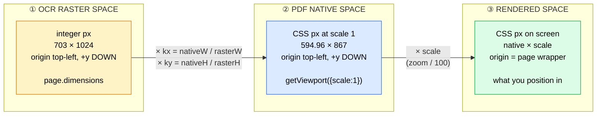

| # | Space | Units | Origin | Source |
|---|---|---|---|---|
| ① | **OCR raster** | integer px | top-left, +y down | `page.dimensions.{width,height}` |
| ② | **PDF native** | CSS px at scale 1 | top-left, +y down | `pdfPage.getViewport({scale: 1})` |
| ③ | **Rendered** | CSS px | top-left of the page wrapper | native × scale |

**PDF user space does not appear.** PDF.js's `getViewport()` has already flipped the
PDF's bottom-left origin to a top-left one and applied any intrinsic `/Rotate`. By the
time the application sees numbers, everything is top-left, +y-down. This is why no
Y-inversion appears anywhere — a fact worth internalising, because "PDF coordinates are
bottom-up" is the single most common wrong assumption in this problem space.

### Proving the axis direction, from content rather than assumption **[MEAS]**

| Document | Evidence |
|---|---|
| ULTOMIRIS p0 | `header` block ("Vault PromoMats") has the **smallest** y = 37; the bottom-of-page `table` has the **largest** y = 619 |
| ULTOMIRIS p1/p2 | `footer` blocks carry the **largest** y = 943…1001 |
| Image fixture | image placed at top-left pt y=[102,282] returned y=[121,342]; under y-up it would have returned ≈677 |

Under a bottom-left origin, headers would carry the largest y. They do not.

## 12. The raster space and how it is derived

`dimensions` is the PDF page rasterised at `dimensions.dpi`:

```
dimensions.width  = ceil(pdfPtWidth  × dpi / 72)
dimensions.height = ceil(pdfPtHeight × dpi / 72)
```

Confirmed on five independent samples:

| Source | PDF size (pt) | dpi | computed | declared |
|---|---|---|---|---|
| ULTOMIRIS p0 | 594.96 × 867 | 85 | 702.40 × 1023.54 | **703 × 1024** |
| ULTOMIRIS p1/p2 | 1728 × 2592 | 28 | 672.00 × 1008.00 | **672 × 1008** (exact) |
| `Old Asset_only_5.pdf` | 2048 × 1536 | 36 | 1024.00 × 768.00 | **1024 × 768** (exact) |
| Image fixture | 595 × 842 | 87 | 718.96 × **1017.42** | **719 × 1018** |

The image fixture settles the rounding rule: `1017.42` → `1018`, so it is **`ceil`**, not
round-half-up (which would give 1017). **[MEAS]**

### How dpi is chosen **[HYP — 5 samples, all consistent]**

```
dpi = floor(1024 / longSideInches)
```

| Long side | 1024 / inches | floor | declared |
|---|---|---|---|
| 867 pt = 12.042 in | 85.04 | 85 | **85** |
| 2592 pt = 36.000 in | 28.44 | 28 | **28** |
| 2048 pt = 28.444 in | 36.00 | 36 | **36** |
| 842 pt = 11.694 in | 87.56 | 87 | **87** |

The long side always lands at ≤ 1024 px. This explains why one document produced two
different dpi values — page 0 is A4-ish, pages 1–2 are a 24″ × 36″ banner.

> **You never need this rule.** The viewer always divides by the *declared*
> `dimensions`. It is documented because it explains why `dpi` varies per page, and
> because it lets you sanity-check a response.

## 13. The exact transform

```js
coordinateScaleX = nativeWidth  / rasterWidth      // "kx"
coordinateScaleY = nativeHeight / rasterHeight     // "ky"
scale            = zoomPercent / 100

left   =  topLeftX                  × coordinateScaleX × scale
top    =  topLeftY                  × coordinateScaleY × scale
width  = (bottomRightX - topLeftX)  × coordinateScaleX × scale
height = (bottomRightY - topLeftY)  × coordinateScaleY × scale
```

Because the overlay container is itself sized `nativeWidth × scale` by
`nativeHeight × scale`, `nativeWidth` **cancels**:

```
left = topLeftX × (nativeWidth / rasterWidth) × scale
     = topLeftX × (nativeWidth × scale) / rasterWidth
     = topLeftX × renderedWidth / rasterWidth
     = (topLeftX / rasterWidth) × renderedWidth        ← the normalised form
```

**Consequence: the PDF's own point size is irrelevant to box placement.** Only the ratio
`bbox / raster` and the rendered page size matter. This is why the transform survives
page 0 and pages 1–2 having wildly different physical sizes (595×867 pt vs 1728×2592 pt)
*and* different rasters (703×1024 vs 672×1008).

### Terms that are absent — each individually checked against source

| Candidate term | Present? |
|---|---|
| Y-axis inversion | **No** |
| Rotation | **No** |
| CropBox / MediaBox adjustment | **No** |
| Viewport offset | **No** |
| Scroll offset | **No** |
| devicePixelRatio | **No** (only in the zoom cap) |
| CSS transform | **No** — every ancestor measured `transform: none` |
| Nested coordinate system | **No** |
| Padding | **No** |

### `coordinateScaleX/Y` are computed *per region*

Verbatim from Mistral's source:

```jsx
{detectedRegions.map(region => (
  <Region
    key={region.id}
    region={region}
    scale={scale}
    coordinateScaleX={pageWidth  / region.originalPageWidth}   // ← per region
    coordinateScaleY={pageHeight / region.originalPageHeight}
    isHovered={hoveredRegionId === region.id}
  />
))}
```

Each region carries its own page's raster dimensions, so a document with pages of
differing size scales each page independently — with a single shared `scale`.

## 14. Proving X and Y are independent

This was the most important open question, and the reason a specific fixture was needed.

**Why it is hard to see.** For most documents the page and its raster have the *same
aspect ratio*, so `kx` and `ky` coincide and any of several wrong models fits perfectly:

| Fixture | native (pt) | raster | kx | ky | difference |
|---|---|---|---|---|---|
| ULTOMIRIS p1/p2 | 1728 × 2592 | 672 × 1008 | 2.571428571 | 2.571428571 | **0.0000 %** ← useless |
| `Old Asset_only_5` | 2048 × 1536 | 1024 × 768 | 2.0 | 2.0 | **0.0000 %** ← useless |
| **ULTOMIRIS p0** | 594.96 × 867 | 703 × 1024 | 0.846315789 | 0.846679688 | **0.0430 %** ← discriminates |
| **Image fixture** | 595 × 842 | 719 × 1018 | 0.827538248 | 0.827111984 | **0.0515 %** ← discriminates |

Five models were fitted against ULTOMIRIS page 0 — 13 boxes × 4 quantities — at zoom
100 % so `scale` is exactly 1:

| Model | RMS | max abs error | Verdict |
|---|---|---|---|
| **A: separate `kx`, `ky`** | **0.008927 px** | **0.014663 px** | ✅ **ACCEPTED** |
| **D: normalised `x/rasterW × renderedW`** | **0.008927 px** | **0.014663 px** | ✅ **ACCEPTED** (identical to A) |
| B: `kx` on both axes | 0.052473 px | 0.161432 px | ❌ rejected — 11× |
| C: `ky` on both axes | 0.062983 px | 0.219752 px | ❌ rejected — 14× |
| E: uniform `min(kx,ky)` | 0.052473 px | 0.161432 px | ❌ rejected — 11× |

**Both axes discriminate independently**, which is what makes this conclusive rather
than merely suggestive:

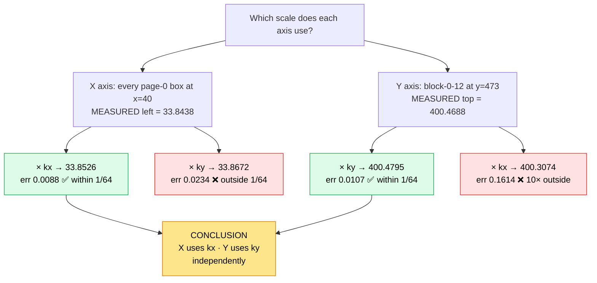

Full verification across all 3 ULTOMIRIS pages — **106 regions, 424 quantities**:
max abs error **0.014663 px**, RMS **0.008257 px**.

### The answer, stated plainly

```
left   = x       / rasterWidth  × renderedWidth      ✅ CONFIRMED
top    = y       / rasterHeight × renderedHeight     ✅ CONFIRMED
width  = (x2-x1) / rasterWidth  × renderedWidth      ✅ CONFIRMED
height = (y2-y1) / rasterHeight × renderedHeight     ✅ CONFIRMED
```

Mistral does **not** use a single shared scale, and does **not** use separate
*transforms* (no per-axis offset, skew, rotation or independent origin). It uses **one
affine scale per axis, each from its own axis's ratio, with zero translation.**

## 15. Sub-pixel truth: the 1/64 px floor

Every residual above is bounded by **0.015625 px = 1/64 px**. That is not coincidence —
it is Blink's `LayoutUnit`, the fixed-point granularity of the layout engine. It is the
resolution limit of `getBoundingClientRect()` itself.

Demonstration: React wrote `left: 45.24px`. The browser reported `45.234375`.

```
45.24 × 64 = 2895.36  →  floor 2895  →  2895/64 = 45.234375  ✅ exactly what was measured
```

So: **the model is exact; the residual is measurement quantisation, not error.**

A useful corollary for the full zoom sweep — at zooms where `native × scale` is a whole
number, the error is *exactly* zero:

| Zoom | scale | native × scale | max abs error |
|---|---|---|---|
| 25 % | 0.25 | 512 × 384 | **0.000000 px** |
| 50 % | 0.50 | 1024 × 768 | **0.000000 px** |
| 75 % | 0.75 | 1536 × 1152 | **0.000000 px** |
| 100 % | 1.00 | 2048 × 1536 | **0.000000 px** |
| 150 % | 1.50 | 3072 × 2304 | **0.000000 px** |
| 200 % | 2.00 | 4096 × 3072 | **0.000000 px** |
| 39 % | 0.39 | 798.72 × 599.04 | 0.015000 px |

### The overlay/canvas disagreement — a real quirk **[MEAS]**

PDF.js floors its layers to whole pixels; the overlay does not. Measured at 39 % zoom:

| Element | width × height |
|---|---|
| `[data-pdf-page]` wrapper (inline style) | 798.72 × 599.04 |
| `.react-pdf__Page` | 798.719 × 599.000 |
| `canvas` (attrs **and** CSS) | **798 × 599** |
| `.textLayer` / `.annotationLayer` | 798 × 599 |
| **overlay container** | **798.719 × 599.031** |

Drift overlay-vs-canvas: **+0.719 px horizontally, +0.031 px vertically at 39 %; exactly
0.000 at every ladder zoom**, because there `native × scale` is a whole number.

So the overlay is very slightly wider than the raster it annotates, and a box at the
extreme right edge can sit ~1 px beyond where pixel content actually ends.

> **Design decision for your own build.** Sizing your overlay from the canvas's *floored*
> CSS box is arguably **more correct** than Mistral — but it will then differ from
> Mistral by up to 1 px at the far edge at non-integer zooms. The clone deliberately
> reproduces Mistral's unfloored behaviour. Pick one and be deliberate about it.

---

# Part V — How it displays

## 16. The DOM tree

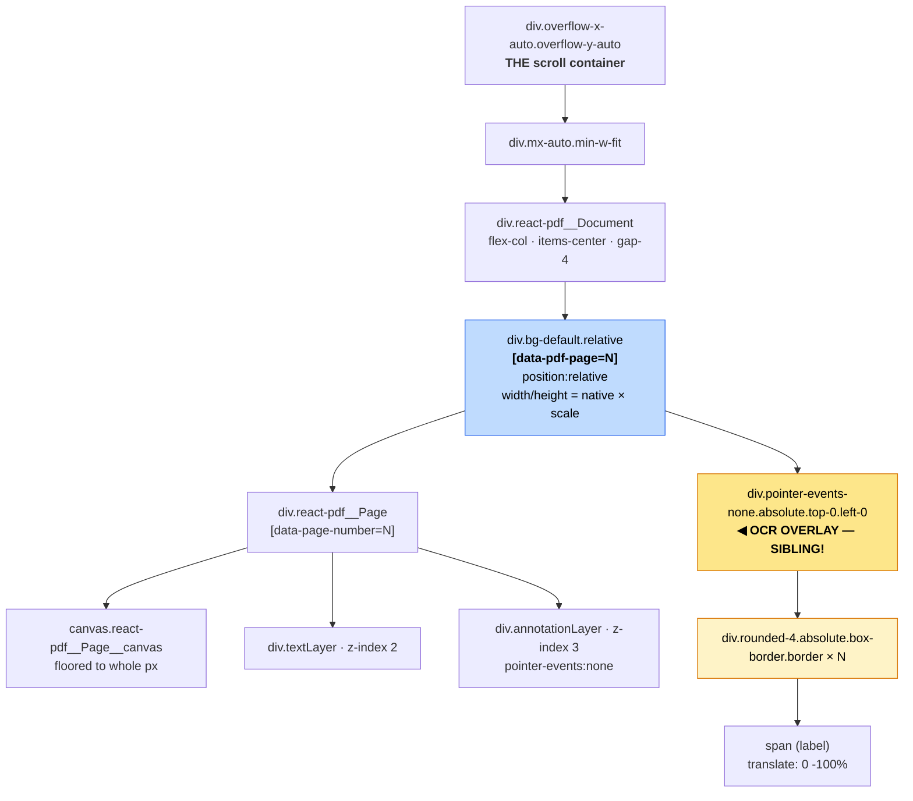

As text:

```
div.flex.size-full.flex-1.flex-col.gap-2.overflow-x-auto.overflow-y-auto   ← THE scroll container
  div.mx-auto.h-full.min-w-fit
    div.react-pdf__Document.flex.flex-col.items-center.gap-4               ← page stack, 16px gap
      div.bg-default.relative[data-pdf-page="1"]                           ← Mistral's wrapper
        div.react-pdf__Page[data-page-number="1"]
          canvas.react-pdf__Page__canvas
          div.react-pdf__Page__textContent.textLayer                       ← z-index 2
          div.react-pdf__Page__annotations.annotationLayer                 ← z-index 3, pe:none
        div.pointer-events-none.absolute.top-0.left-0                      ← OVERLAY (sibling!)
          div.rounded-4.absolute.box-border.border  × N
            span  (the label)
```

### Why "sibling, not child" is the load-bearing structural fact

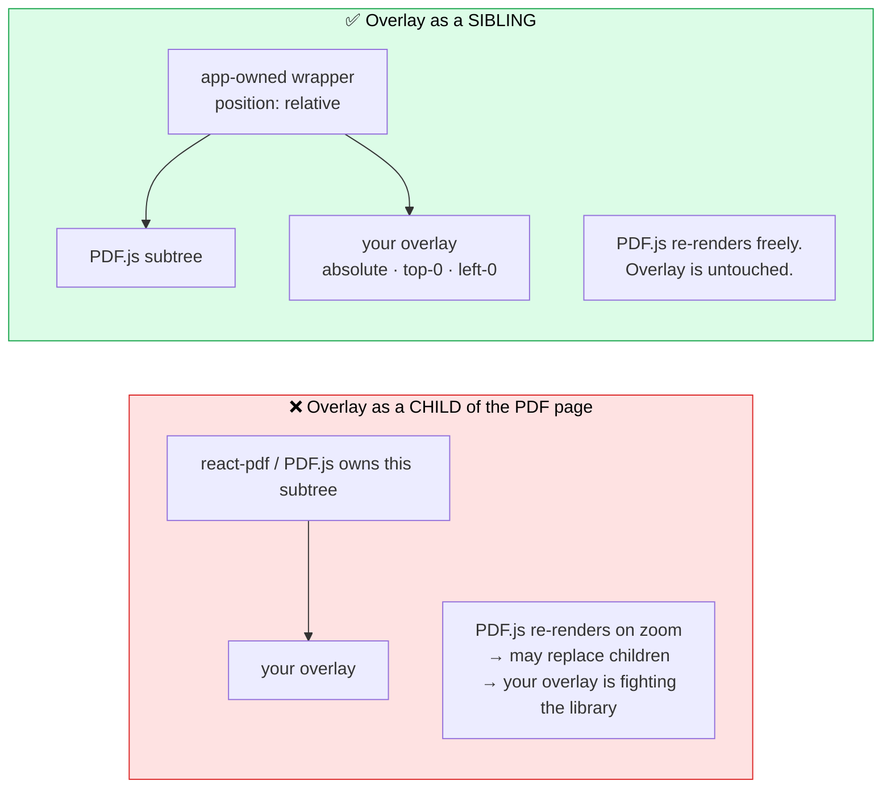

The wrapper is **application-owned** and `position: relative`; the overlay is
`position: absolute; top: 0; left: 0` inside it. The overlay therefore:

- never lives inside a PDF.js-managed subtree, so re-renders cannot clobber it
- is positioned against a box whose size you control exactly
- paints above the canvas purely by being a **later sibling** — it has `z-index: auto`

Other measured facts about the layout:

| Fact | Detail |
|---|---|
| The window never scrolls | `documentElement.scrollHeight == clientHeight == 832` |
| The scroll container | the `overflow-x-auto overflow-y-auto` div |
| Horizontal centring | `mx-auto` + `items-center`, **not** a transform |
| Wide-page safety | `min-w-fit` prevents clipping when a scaled page exceeds the viewport |
| Zoom mechanism | **no CSS transform** anywhere; PDF.js re-renders the canvas at the new scale |
| Inter-page gap | `gap-4` = 16 px |
| Scrollbar effect | container `clientWidth` drops 823 → 808 once content overflows |

## 17. The overlay implementation

De-minified from Mistral's bundle (module **276369**), names restored from prop names
and string literals:

```jsx
function DetectedRegionOverlay({ detectedRegions, scale, pageWidth, pageHeight, hoveredRegionId }) {
  return (
    <div className="pointer-events-none absolute top-0 left-0"
         style={{ width: pageWidth * scale, height: pageHeight * scale }}>
      {detectedRegions.map(region => (
        <Region
          key={region.id}
          region={region}
          scale={scale}
          coordinateScaleX={pageWidth  / region.originalPageWidth}
          coordinateScaleY={pageHeight / region.originalPageHeight}
          isHovered={hoveredRegionId === region.id}
        />
      ))}
    </div>
  );
}

const Region = memo(function ({ region, scale, coordinateScaleX, coordinateScaleY, isHovered }) {
  const { bounds, label, colorScheme = "orange" } = region;
  const style = {
    left:    bounds.topLeftX * coordinateScaleX * scale,
    top:     bounds.topLeftY * coordinateScaleY * scale,
    width:  (bounds.bottomRightX - bounds.topLeftX) * coordinateScaleX * scale,
    height: (bounds.bottomRightY - bounds.topLeftY) * coordinateScaleY * scale,
  };
  const { fill, accent, border, text } = COLOR_TOKENS[colorScheme];
  return (
    <div style={style}
         className={cn("rounded-4 absolute box-border border",
                       isHovered ? "bg-brand-400/10 border-brand-400" : [fill, border])}>
      {label && (
        <span title={label.text}
              className={cn("rounded-t-4 pointer-events-auto absolute top-0 left-0.5 flex w-max",
                            "-translate-y-full flex-row items-center gap-x-1 px-1 py-0.5",
                            isHovered ? "bg-brand-500" : accent)}>
          {label.regionNumber !== undefined && (
            <TypographySpan size="2xs" className={isHovered ? "text-brand-100/50" : [text, "opacity-50"]}>
              {label.regionNumber}
            </TypographySpan>
          )}
          <TypographySpan size="2xs" className={isHovered ? "text-brand-100" : text}>
            {label.text}
          </TypographySpan>
        </span>
      )}
    </div>
  );
});
```

### The measured rendered result

One box, `block-0-0`, type `text`, at 39 % zoom:

```html
<div class="rounded-4 absolute box-border border bg-badge-pinkdeep border-basic-pinkdeep-strong"
     style="left: 45.24px; top: 58.5px; width: 478.92px; height: 25.74px;">
  <span class="rounded-t-4 pointer-events-auto absolute top-0 left-0.5 flex w-max
               -translate-y-full flex-row items-center gap-x-1 px-1 py-0.5
               bg-basic-pinkdeep-strong"
        title="text">
    <span class="text-2xs leading-[0.75rem] text-inverted-default">text</span>
  </span>
</div>
```

Computed **[MEAS]**: `position: absolute`, `box-sizing: border-box`,
`border: 1px solid rgb(152,51,132)`, `background: rgba(225,125,210,0.1)`,
`border-radius: 4px`, `z-index: auto`, `pointer-events: none`, `opacity: 1`.

### Five details that are easy to get wrong

| Detail | Why it matters |
|---|---|
| **Style values are unitless numbers** | React serialises them as `px`. `left: 45.24` → `left: 45.24px` |
| **`box-sizing: border-box`** | The 1 px border is drawn **inside** the computed width/height. Without this, every box is 2 px too big |
| **Container is `pointer-events: none`** | This is what makes the whole overlay click-through, so text selection on the PDF still works |
| **Label is `pointer-events: auto`** | The *only* interactive affordance — and only so its native `title` tooltip appears |
| **No `overflow: hidden` on the container** | An out-of-range bbox bleeds outside the page rather than being clipped |

## 18. Colour system

Each scheme is four tokens: `{fill, accent, border, text}` — box background, label
background, box border, label text.

The concrete values were recovered by injecting probe elements carrying Mistral's real
Tailwind token classes and reading `getComputedStyle`, then cross-checked against a live
region box for `fuchsia`. **[MEAS]**

| Scheme | Used by | fill (box bg) | accent (label bg) & border | label text |
|---|---|---|---|---|
| `blue` | `title` | `rgba(6,126,255,0.1)` | `rgb(2,98,191)` | white |
| `green` | `image` | `rgba(88,220,6,0.1)` | `rgb(49,142,104)` | white |
| `pink` | `equation` | `rgba(254,104,203,0.1)` | `rgb(168,14,120)` | white |
| `yellow` | `caption` | `rgba(255,208,27,0.1)` | `rgb(255,175,1)` | **`rgb(32,31,28)` dark** |
| `red` | `table` | `rgba(255,93,89,0.1)` | `rgb(244,54,37)` | white |
| `orange` | `aside_text` **+ default** | `rgba(252,120,59,0.1)` | `rgb(250,80,15)` | white |
| `cyan` | `code` | `rgba(28,218,244,0.1)` | `rgb(10,120,148)` | white |
| `indigo` | `footer` | `rgba(126,134,251,0.1)` | `rgb(96,96,248)` | white |
| `gray` | `header` | **`rgba(0,0,0,0.06)`** | `rgb(97,95,87)` | white |
| `violet` | `list` | `rgba(177,144,240,0.1)` | `rgb(148,101,231)` | white |
| `lime` | `references` | `rgba(215,225,58,0.1)` | `rgb(110,121,18)` | white |
| `fuchsia` | `text` | `rgba(225,125,210,0.1)` | `rgb(152,51,132)` | white |
| `teal` | `signature` | `rgba(83,210,190,0.1)` | `rgb(45,118,111)` | white |

Two exceptions worth noting: **`yellow` is the only scheme with dark label text**, and
**`gray` is the only fill that is not 10 % alpha** (it is 6 % black).

**Hover overrides the scheme entirely:**

| Element | Normal | Hovered |
|---|---|---|
| box background | scheme `fill` | `rgba(255,101,41,0.1)` (`bg-brand-400/10`) |
| box border | scheme `border` | `rgb(255,101,41)` (`border-brand-400`) |
| label background | scheme `accent` | `rgb(250,80,15)` (`bg-brand-500`) |
| label text | scheme `text` | `rgb(255,220,207)` (`text-brand-100`) |

**Default when `colorScheme` is absent:** `orange`. This matters — regions built from
`images[]` deliberately carry no `colorScheme`, so they all render orange.

## 19. Labels

The label sits **above** the box, left-aligned with a small offset:

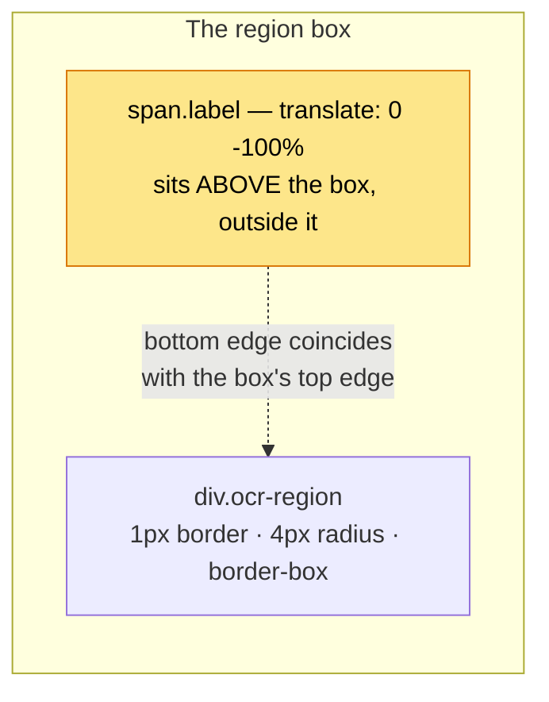

Measured metrics **[MEAS]**:

| Property | Value | Tailwind source |
|---|---|---|
| position | `absolute; top: 0; left: 2px` | `top-0 left-0.5` |
| vertical shift | `translate: 0 -100%` | `-translate-y-full` |
| layout | `flex; flex-direction: row; align-items: center` | `flex flex-row items-center` |
| gap | `4px` | `gap-x-1` |
| padding | `2px 4px` | `py-0.5 px-1` |
| width | `max-content` | `w-max` |
| radius | `4px 4px 0 0` | `rounded-t-4` |
| font size | **`11px`** | `text-2xs` |
| line height | **`12px`** | `leading-[0.75rem]` |
| pointer events | `auto` | `pointer-events-auto` |

> **A subtlety.** Tailwind v4 emits `-translate-y-full` via the modern **`translate`**
> property, not `transform` — so `getComputedStyle(el).transform` reads `none` while the
> element is visibly shifted. If you are checking this in DevTools, read `translate`.

> **The 2 px vs 3 px trap.** `left: 2px` positions against the box's *padding box*, and
> the box has a 1 px border, so the label's rendered offset from the *border box* is
> **3 px**. Mistral measures 2.995. A test asserting 2 will fail against a correct
> implementation — as ours did, once.

### Label content

| Region source | `label.text` | `label.regionNumber` |
|---|---|---|
| Block path (`include_blocks`) | the block **type** — `"text"`, `"title"`, … | **absent** |
| Image path (`images[]`) | the image **id** — `"img-0.jpeg"` | a document-**global** 1-based counter |

The `regionNumber` renders at 50 % opacity before the text.

---

# Part VI — Behaviour

## 20. Zoom

### Initial fit **[SRC+MEAS]**

```js
const availableWidth = scrollContainer.clientWidth - 16;      // 16px gutter constant
const fitZoomPct     = Math.floor(availableWidth / maxNativeWidth * 100);
const initialZoomPct = Math.min(fitZoomPct, 100, canvasCapPct);
```

Two behaviours fall out of that `Math.min`:

- fit uses the **widest page in the document**, so all pages share one zoom
- it is **capped at 100 %** — the viewer never zooms *in* to fit a small page

Verified against three observed cases:

| Document | max native width | container | `floor((cw−16)/w×100)` | Observed |
|---|---|---|---|---|
| `Old Asset_only_5.pdf` | 2048 | 823 | 39 | **39 %** ✅ |
| ULTOMIRIS | 1728 | 823 | 46 | **46 %** ✅ |
| Image fixture | 595 | 823 | 135 → clamped by `100` | **100 %** ✅ |

### The canvas cap — the only place devicePixelRatio appears **[SRC]**

```js
function maxZoomPercent(pageDims, isMobile) {
  let maxSide = 0;
  for (const d of pageDims) maxSide = Math.max(maxSide, d.nativeWidth, d.nativeHeight);
  if (maxSide === 0) return Infinity;
  return Math.floor((isMobile ? 8192 : 16384) / (maxSide * window.devicePixelRatio) * 100);
}
```

This guards the browser's maximum canvas dimension. For a 2048-px page at DPR 1 it
yields **800 %**; at DPR 2, **400 %**; on mobile (8192 limit), **400 %**.

> **`devicePixelRatio` enters the system here and nowhere else.** It bounds maximum zoom
> and never appears in box placement. HiDPI canvas backing-store scaling is handled
> inside PDF.js and is invisible to the overlay, because the overlay is sized in CSS px.

### Controls **[SRC]**

```js
const ZOOM_LADDER = [25, 50, 75, 100, 125, 150, 200, 250, 300, 400, 500];
```

| Control | Behaviour |
|---|---|
| Effective max | `min(canvasCap, 500)` |
| `Zoom out` | `steps.filter(s => s < zoom).pop()` — greatest step strictly below |
| `Zoom in` | `steps.find(s => s > zoom)` — least step strictly above |
| Text box | free-form; `parseInt(value.replace(/%$/, ''))`; commits **on blur** (Enter just blurs) |
| Accepted range | `>= 25 && <= effectiveMax`. **Arbitrary integers allowed** — the ladder only governs the buttons |
| Display | raw typed string while focused; `${zoom}%` when not |

### Zoom preserves the viewport centre **[SRC]**

```js
const before = offsetWithin(currentPageEl, container);
const cy = before.height > 0 ? (scrollTop  + clientHeight/2 - before.top ) / before.height : 0;
const cx = before.width  > 0 ? (scrollLeft + clientWidth /2 - before.left) / before.width  : 0;

flushSync(() => setZoom(newZoom));           // force synchronous re-layout

const after = offsetWithin(currentPageEl, container);
container.scrollTop  = Math.max(0, after.top  + cy * after.height - container.clientHeight/2);
container.scrollLeft = Math.max(0, after.left + cx * after.width  - container.clientWidth /2);

function offsetWithin(el, container) {       // element offset in container scroll space
  const a = el.getBoundingClientRect(), b = container.getBoundingClientRect();
  return { top:  a.top  - b.top  + container.scrollTop,
           left: a.left - b.left + container.scrollLeft,
           width: a.width, height: a.height };
}
```

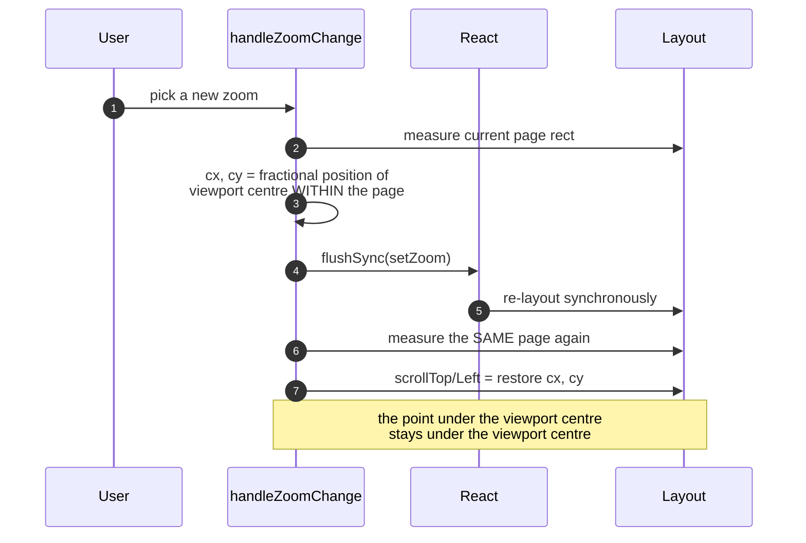

The key mechanism is **`flushSync`** — it forces React to commit and the browser to
re-layout inside the same tick, so the post-zoom geometry can be measured immediately.
Without it you would measure the *old* layout and the anchor would be wrong.

Note it anchors to the **current page**, not the document, so `cx`/`cy` can legitimately
fall outside `[0,1]` when the page is smaller than the viewport — the arithmetic still
holds.

## 21. Scroll and page tracking

### Current page = greatest visible height **[SRC]**

```js
const io = new IntersectionObserver((entries) => {
  if (isScrollingRef.current) return;              // suppressed during programmatic scroll
  for (const e of entries) {
    const n = Number(e.target.getAttribute('data-pdf-page'));
    e.isIntersecting ? visible.set(n, e.intersectionRect.height) : visible.delete(n);
  }
  let best = 0, bestH = 0;
  for (const [n, h] of visible) if (h > bestH) { best = n; bestH = h; }
  if (best) setCurrentPage(best);
}, { root: scrollContainer, threshold: [0, .1, .2, .3, .4, .5, .6, .7, .8, .9, 1] });
```

Not the *first* intersecting page — the one with the **greatest visible height**. The
11-step threshold array is what makes the height readings update smoothly as you scroll.

The `isScrollingRef` guard is important: without it, a programmatic
`scrollToPage(5)` would fire the observer mid-flight and let it fight the scroll.

### `scrollToRegion` **[SRC+MEAS]**

```js
isScrollingRef.current = true;
flushSync(() => setCurrentPage(region.pageNumber));

const pageEl = container.querySelector(`[data-pdf-page="${region.pageNumber}"]`);
const dims   = pageDimensionsByPageIndex.get(region.pageNumber - 1);
const ky     = dims.nativeHeight / region.originalPageHeight;
const yInPage= region.bounds.topLeftY * ky * dims.scale;
const target = offsetWithin(pageEl, container).top + yInPage - 30;   // 30px label headroom

container.scrollTo({ top: Math.max(0, target), behavior: 'instant' });
isScrollingRef.current = false;
```

**Vertical only — `scrollLeft` is never touched.** The `-30` is headroom for the label,
which sits above the box.

Verified at 200 % zoom:

| Region | `topLeftY` | Predicted `scrollTop` | Measured | Note |
|---|---|---|---|---|
| `block-0-15` | 536 | **2114.00** | **2114** | exact |
| `block-0-18` | 750 | 2970.00 | 2403 | browser clamp: `scrollHeight − clientHeight = 3072 − 669` |

`scrollLeft` held at 1645 throughout, confirming vertical-only.

> **Consequence to be aware of:** a region far to the right at high zoom is scrolled to
> vertically but may remain horizontally off-screen. This is Mistral's behaviour, faithfully.

## 22. Hover, selection and synchronisation

### The direction of data flow

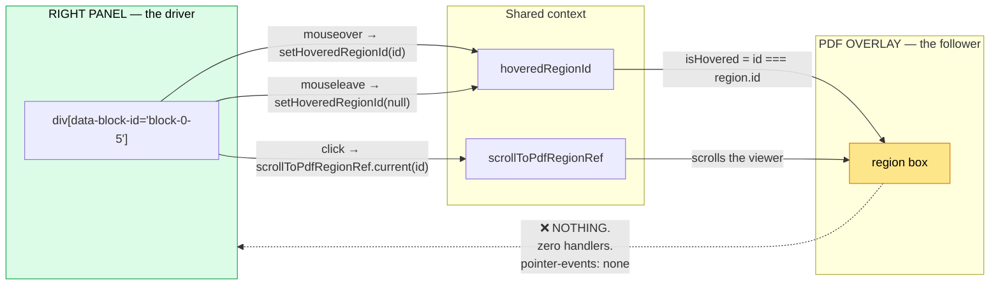

**Synchronisation is strictly one-directional: right panel → PDF.**

### The panel side **[SRC]**

Mistral's TipTap `blockWrapper` node installs a ProseMirror plugin:

```js
handleDOMEvents: {
  mouseover: (view, event) => {
    const el = event.target.closest('[data-block-id]');
    const id = el?.getAttribute('data-block-id') ?? null;
    if (id !== last) { last = id; onBlockHover(id); }
    return false;
  },
  mouseleave: () => { if (last !== null) { last = null; onBlockHover(null); } return false; },
  click: (view, event) => {
    const id = event.target.closest('[data-block-id]')?.getAttribute('data-block-id');
    if (id) onBlockClick(id);
    return false;
  },
}
```

Note `closest('[data-block-id]')` — a single delegated listener resolves any descendant
to its owning block. That is why clicking *anywhere* inside a block, including on an
image card, resolves correctly.

The panel's own hover affordance is **pure CSS**, no JS:

```
relative border-l-2 border-transparent pl-2 rounded
md:hover:bg-[color-mix(in_srgb,var(--color-brand-400)_10%,transparent)]
md:hover:border-l-[var(--color-brand-400)]
md:after:content-[attr(data-block-label)] md:after:absolute md:after:bottom-full md:after:left-0
md:after:bg-[var(--color-brand-500)] md:after:text-[var(--color-brand-100)]
md:after:opacity-0 md:hover:after:opacity-100
md:data-[block-type=image]:after:hidden
```

The panel's label is a `::after` pseudo-element fed by `content: attr(data-block-label)`,
faded in on hover — and **hidden for `image` blocks**, because the image card supplies
its own header chip. All of it is `md:`-gated, so small screens get no hover affordance.

### The join key

**`block-<pageIndex>-<ordinal>`** — identical on both sides.

```js
function blockRegionId(pageIndex, ordinal) { return `block-${pageIndex}-${ordinal}`; }
```

Note this is a **synthesised ordinal**, not any id present in the OCR JSON. Mistral
ignores the JSON's own `id` field entirely.

### There is no selection model **[SRC+MEAS]**

| Claim | Evidence |
|---|---|
| No "selected" state exists — only `hoveredRegionId` | no `selectedRegionId`, no persistent class, no `aria-selected` anywhere |
| Region boxes have **zero** handlers | React props on a box are exactly `["style","className","children"]` |
| Label has only `title` | props are exactly `["className","title","children"]` |
| Hovering a box does nothing | dispatched `mouseover`/`mouseenter` → `highlighted = []` |
| Clicking a box does nothing | dispatched `click` → no highlight, **zero** scroll change |
| Clicking a panel block does not latch | it scrolls and leaves the hover highlight, which clears on mouseleave |

So **"click a bbox to select the corresponding text" does not exist in this product.**

> **If you want bidirectional sync**, that is a feature you are *adding*, not
> reproducing. The mechanism is small: set the box to `pointer-events: auto` and call
> your `setHoveredRegionId` / a new `setSelectedRegionId` from it. Remember the
> container is `pointer-events: none`, so you must re-enable on the box itself.

### A fragility in Mistral worth knowing **[SRC]**

Block wrappers are emitted only if **all** of these hold:

```js
showBlocks && !translatedMarkdown
  && page.blocks?.some(b => b.kind === 'block')
  && page.blocks.map(b => b.kind === 'orphan' ? b.content : b.block.content).join('\n\n') === page.markdown
```

That last clause is a **strict string equality** between the re-joined block contents and
the page markdown. If OCR markdown does not reconstruct exactly from block contents, the
app silently falls back to plain markdown with **no block wrappers and therefore no sync
at all**. It also disables sync whenever a translation is active.

This is the most likely cause of "hover sync mysteriously stopped working" in the real
product — and a good reason for your own implementation to key sync off block *indices*
rather than a markdown round-trip.

## 23. Images

### Where the pixels come from

```json
{
  "id": "img-0.jpeg",
  "top_left_x": 360, "top_left_y": 121,
  "bottom_right_x": 655, "bottom_right_y": 342,
  "image_base64": "data:image/jpeg;base64,/9j/4AAQSkZJRgABAQAAAQABAAD/2wBD…//2Q==",
  "image_annotation": null
}
```

| Property | Value |
|---|---|
| Scheme | **`data:`** — a complete URI |
| MIME | `image/jpeg` |
| Encoding marker | `;base64` |
| Length (this sample) | 23 747 chars |
| Tail | `//2Q==` (base64 of JPEG EOI `FF D9`) |
| How the app uses it | **verbatim as ``** — measured `img.src.length === 23747`, identical |

**So: do not prefix it. It is ready to use.** This was also provable from source before
we captured it, via the round-trip regex Mistral uses when serialising markdown back:

```js
new RegExp(`(!\\[${escapeRe(id)}\\])\\(data:image[^)]+\\)`, 'g')   // matches ](data:image...)
```

**Bonus finding:** the decoded image is `naturalWidth × naturalHeight = 295 × 221`, and
the OCR bbox is `(655−360) × (342−121) = 295 × 221`. **Exactly equal.** The returned
image is a crop of the OCR raster at exactly the bbox size — which gives you a free
independent check on the bbox.

### Image bboxes share the text-block coordinate system

This was proven with a purpose-built fixture, because it is the kind of thing that is
easy to assume and expensive to get wrong.

| Quantity | Value |
|---|---|
| Page MediaBox | 595 × 842 pt |
| Image placed at (PDF user space, y-**up**) | x `[300, 540]`, y `[560, 740]` |
| Same placement in top-left pt | x `[300, 540]`, y `[102, 282]` |
| OCR raster returned | 719 × 1018 @ dpi 87 |
| Predicted bbox `pt × 87/72` | `(362.5, 123.2) – (652.5, 340.8)` |
| **Mistral returned** | **`(360, 121) – (655, 342)`** |

Agreement to ~2–3 px, which is the OCR model's own edge-detection slack. The
discriminating test is the alternative hypothesis: under a **y-up** system the image's
`y1` would have been `(842−282) × 87/72 = 676.7`, not **121**. It is 121.

Confirmed a second way — the `image` block fits the single transform alongside the text
blocks with **no special-casing**:

| id | type | OCR bbox | max err |
|---|---|---|---|
| `block-0-0` | title | (69,56)-(289,83) | 0.0115 |
| `block-0-1` | text | (69,99)-(331,115) | 0.0150 |
| `block-0-2` | text | (69,122)-(363,139) | 0.0149 |
| **`block-0-3`** | **image** | **(360,121)-(655,342)** | **0.0144** |
| `block-0-4` | caption | (69,375)-(291,393) | 0.0130 |
| `block-0-5` | text | (68,424)-(436,464) | 0.0080 |
| `block-0-6` | text | (69,642)-(374,659) | 0.0140 |

Also: the `image` block's bbox is **identical** to `images[0]`'s, and the block carries
**`image_id: "img-0.jpeg"`** while every non-image block has `image_id: null`.

### Markdown integration **[SRC]**

OCR markdown references images by id — ``. Mistral maintains two
derived structures and a rewriting pair:

| Function | Produces |
|---|---|
| `imageMapping = sL(pages)` | `[{id, url: imageBase64}]` — only where base64 exists |
| `imageMetadata = sP(pages)` | `[{id, url, topLeftX, topLeftY, width, height, annotation}]` — where base64 **or** annotation exists. Note `width/height` are **derived** (`x2 − x1`) |
| **render:** `sM(markdown, imageMetadata)` | rewrites `` → an `` carrying `data-top-left-x`, `data-top-left-y`, `data-width`, `data-height` |
| **save:** `sx(markdown, imageMapping)` | rewrites `](data:image…)` → `](id)`, so edits round-trip without embedding megabytes of base64 |

### The image card

Rendered as a custom TipTap NodeView:
`div.react-renderer.node-image > div.ocr-image-wrapper > div.group.cursor-pointer`.

Structure: an id chip (`font-mono text-xs`, top-left, `rounded-t-md border border-b-0`),
then two pill badges — `x: {topLeftX}, y: {topLeftY}` and `{width} × {height}` — then the
image and/or a collapsible annotation JSON block. Badges hide below a `min-[320px]`
breakpoint.

Measured for `img-0.jpeg`: chip `img-0.jpeg`, badges **`x: 360, y: 121`** and
**`295 × 221`** — exactly `655−360` × `342−121`.

### Two image gotchas

**① `include_image_base64: true` does not guarantee images.** ULTOMIRIS returned
`images: []` and zero `image`-type blocks on all 3 pages *with the flag set*. Image
extraction is content-dependent — the model must first classify a region as an image.
**Treat `images: []` as an ordinary case, never an error.**

**② Two region-building paths exist, with incompatible id namespaces.**

| Builder | id | label | colorScheme |
|---|---|---|---|
| `formatBlockDetectedRegions` | `block-<page>-<ordinal>` | block type | from the type map |
| `formatDetectedRegions` | the image id, e.g. `img-0.jpeg` | image id **+ global `regionNumber`** | **absent → orange** |

Only one set is mounted at a time. Mistral's image *card* wires its own handlers to the
**image id** while mounted block regions are keyed `block-0-N` — so those handlers cannot
resolve a region when the block path is active. Whether that is a latent no-op in Mistral
is unresolved (see §35).

---

# Part VII — Building it

## 24. Clone architecture

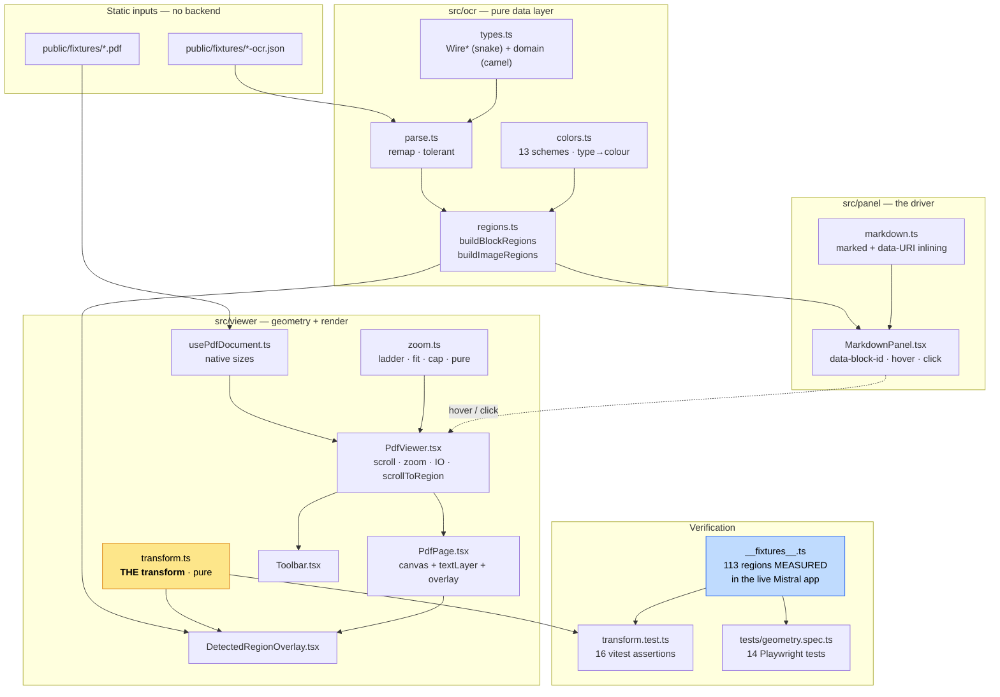

### Deliberate design choices

| Choice | Rationale |
|---|---|
| **`pdfjs-dist` directly, not `react-pdf`** | Already a dependency; the overlay is renderer-independent; direct use gives exact DOM control. Adding `react-pdf` would be a new dependency for a canvas plus a text layer |
| **`transform.ts` is pure and isolated** | It is the one thing that must be exactly right. Pure ⇒ unit-testable without a browser |
| **`zoom.ts` is pure** | Same reason. The fit/cap/ladder logic is fully testable |
| **Ground truth checked into the repo** | `__fixtures__.ts` holds 113 regions *measured in Mistral*, so tests compare against **Mistral's own numbers**, not our arithmetic |
| **Panel is plain React, not TipTap** | Editing was out of scope; the same `data-block-*` contract gives identical sync semantics |
| **`marked` for markdown** | The same library Mistral uses |

### File inventory

| File | Lines | Role |
|---|---|---|
| `src/ocr/types.ts` | 130 | Wire + domain models, `BLOCK_TYPES` |
| `src/ocr/parse.ts` | 93 | Wire→domain remap, tolerant of nulls |
| `src/ocr/colors.ts` | 81 | 13 schemes, type→colour, hover scheme |
| `src/ocr/regions.ts` | 110 | Both region builders, id generation |
| `src/viewer/transform.ts` | 138 | **The transform**, `regionScrollTop`, `offsetWithin` |
| `src/viewer/zoom.ts` | 85 | Ladder, fit, cap, input parsing |
| `src/viewer/usePdfDocument.ts` | 62 | Load PDF, collect native sizes |
| `src/viewer/DetectedRegionOverlay.tsx` | 99 | The overlay |
| `src/viewer/PdfPage.tsx` | 135 | Wrapper + canvas + text layer + overlay sibling |
| `src/viewer/PdfViewer.tsx` | 236 | Shell: scroll, zoom anchoring, IO, scrollToRegion |
| `src/viewer/Toolbar.tsx` | 79 | Page nav + zoom |
| `src/panel/MarkdownPanel.tsx` | 145 | Right panel, sync driver, image cards |
| `src/panel/markdown.ts` | 37 | `marked` + image data-URI inlining |
| `src/viewer/transform.test.ts` | 223 | 16 unit assertions |
| `src/viewer/__fixtures__.ts` | 3167 | Measured ground truth (generated) |
| `tests/geometry.spec.ts` | 398 | 14 Playwright tests |

## 25. The code, module by module

### 25.1 `transform.ts` — the whole point

```ts
export interface PageGeometry {
  nativeWidth: number    // pdfPage.getViewport({scale:1}).width
  nativeHeight: number   // pdfPage.getViewport({scale:1}).height
  scale: number          // zoomPercent / 100
}
export interface RasterSize { width: number; height: number }   // page.dimensions

/** Per-axis scales. Exposed separately because their independence is the key finding. */
export function coordinateScales(page: PageGeometry, raster: RasterSize) {
  return {
    x: page.nativeWidth / raster.width,
    y: page.nativeHeight / raster.height,
  }
}

/** Mistral-identical form. */
export function boundsToBox(b: Bounds, page: PageGeometry, raster: RasterSize) {
  const k = coordinateScales(page, raster)
  return {
    left:   b.topLeftX * k.x * page.scale,
    top:    b.topLeftY * k.y * page.scale,
    width:  (b.bottomRightX - b.topLeftX) * k.x * page.scale,
    height: (b.bottomRightY - b.topLeftY) * k.y * page.scale,
  }
}

/** Algebraically identical; makes clear the PDF's point size is irrelevant. */
export function boundsToBoxNormalised(
  b: Bounds, renderedWidth: number, renderedHeight: number, raster: RasterSize,
) {
  return {
    left:   (b.topLeftX / raster.width)  * renderedWidth,
    top:    (b.topLeftY / raster.height) * renderedHeight,
    width:  ((b.bottomRightX - b.topLeftX) / raster.width)  * renderedWidth,
    height: ((b.bottomRightY - b.topLeftY) / raster.height) * renderedHeight,
  }
}

export const REGION_SCROLL_HEADROOM = 30

export function regionScrollTop(
  b: Bounds, page: PageGeometry, raster: RasterSize, pageOffsetTopWithinScroller: number,
): number {
  const ky = page.nativeHeight / raster.height
  const yInPage = b.topLeftY * ky * page.scale
  return Math.max(0, pageOffsetTopWithinScroller + yInPage - REGION_SCROLL_HEADROOM)
}

/** Mistral's `rE()` helper: element offset within a scroll container's scroll space. */
export function offsetWithin(el: HTMLElement, container: HTMLElement) {
  const a = el.getBoundingClientRect()
  const b = container.getBoundingClientRect()
  return {
    top:  a.top  - b.top  + container.scrollTop,
    left: a.left - b.left + container.scrollLeft,
    width: a.width, height: a.height,
  }
}
```

### 25.2 `regions.ts` — blocks → view-model

```ts
export function blockRegionId(pageIndex: number, ordinal: number) {
  return `block-${pageIndex}-${ordinal}`
}

export function buildBlockRegions(doc: OcrDocument): Map<number, Region[]> {
  const out: Region[] = []
  for (const page of doc.pages) {
    if (!page.blocks.length) continue
    page.blocks.forEach((block, ordinal) => {
      out.push({
        id: blockRegionId(page.index, ordinal),
        pageNumber: page.index + 1,
        bounds: block.bounds,
        label: { text: block.type },                    // no regionNumber on the block path
        colorScheme: BLOCK_TYPE_COLOR[block.type],
        originalPageWidth: page.rasterWidth,            // ← the X denominator
        originalPageHeight: page.rasterHeight,          // ← the Y denominator
      })
    })
  }
  return groupByPage(out)
}

export function buildImageRegions(doc: OcrDocument): Map<number, Region[]> {
  const out: Region[] = []
  let counter = 0                                       // document-GLOBAL counter
  for (const page of doc.pages) {
    for (const img of page.images) {
      if (!img.bounds) continue
      out.push({
        id: img.id,
        pageNumber: page.index + 1,
        bounds: img.bounds,
        label: { text: img.id, regionNumber: ++counter },
        originalPageWidth: page.rasterWidth,
        originalPageHeight: page.rasterHeight,
        // NO colorScheme → the overlay's 'orange' default applies
      })
    }
  }
  return groupByPage(out)
}
```

### 25.3 `DetectedRegionOverlay.tsx`

```tsx
const RegionBox = memo(function RegionBox({ region, page, isHovered }) {
  const raster = { width: region.originalPageWidth, height: region.originalPageHeight }
  const box = boundsToBox(region.bounds, page, raster)
  const scheme = isHovered ? HOVER_SCHEME : COLOR_SCHEMES[region.colorScheme ?? DEFAULT_COLOR_SCHEME]

  return (
    <div
      className="ocr-region"
      data-region-id={region.id}
      data-region-type={region.label.text}
      data-hovered={isHovered ? 'true' : undefined}
      style={{
        left: box.left, top: box.top, width: box.width, height: box.height,
        backgroundColor: scheme.fill, borderColor: scheme.border,
      }}
    >
      <span className="ocr-region-label" title={region.label.text}
            style={{ backgroundColor: scheme.accent }}>
        {region.label.regionNumber !== undefined && (
          <span className="ocr-region-number" style={{ color: scheme.text }}>
            {region.label.regionNumber}
          </span>
        )}
        <span className="ocr-region-text" style={{ color: scheme.text }}>
          {region.label.text}
        </span>
      </span>
    </div>
  )
})

export const DetectedRegionOverlay = memo(function ({
  regions, scale, pageWidth, pageHeight, hoveredRegionId,
}) {
  const page = { nativeWidth: pageWidth, nativeHeight: pageHeight, scale }
  return (
    <div
      className="ocr-overlay"
      // Sized from the UNFLOORED product, exactly as Mistral does.
      style={{ width: pageWidth * scale, height: pageHeight * scale }}
    >
      {regions.map((r) => (
        <RegionBox key={r.id} region={r} page={page} isHovered={hoveredRegionId === r.id} />
      ))}
    </div>
  )
})
```

The critical CSS:

```css
.ocr-overlay {
  position: absolute; top: 0; left: 0;
  pointer-events: none;               /* makes the whole overlay click-through */
}
.ocr-region {
  position: absolute;
  box-sizing: border-box;             /* 1px border drawn INSIDE the box */
  border: 1px solid;
  border-radius: 4px;
  pointer-events: none;
}
.ocr-region-label {
  position: absolute; top: 0; left: 2px;
  translate: 0 -100%;                 /* sits ABOVE the box */
  display: flex; flex-direction: row; align-items: center;
  column-gap: 4px; padding: 2px 4px;
  width: max-content;
  border-radius: 4px 4px 0 0;
  pointer-events: auto;               /* only so the title tooltip works */
}
.ocr-region-text, .ocr-region-number { font-size: 11px; line-height: 12px; white-space: pre; }
.ocr-region-number { opacity: 0.5; }
```

### 25.4 `PdfPage.tsx` — the sibling structure, and the flooring

```tsx
<div className="pdf-page-wrapper" data-pdf-page={pageIndex + 1}
     style={{ width: dimensions.width, height: dimensions.height }}>
  <div className="pdf-page-content">           {/* PDF.js owns this */}
    <canvas ref={canvasRef} dir="ltr" />
    <div ref={textLayerRef} className="textLayer" />
  </div>
  {showDetectedRegions && regions.length > 0 && (
    <DetectedRegionOverlay                      {/* ← SIBLING */}
      regions={regions}
      scale={dimensions.scale}
      pageWidth={dimensions.nativeWidth}
      pageHeight={dimensions.nativeHeight}
      hoveredRegionId={hoveredRegionId}
    />
  )}
</div>
```

The render effect, showing the DPR handling and the deliberate flooring:

```ts
const page = await pdf.getPage(pageIndex + 1)
const viewport = page.getViewport({ scale: dimensions.scale })

// PDF.js floors the canvas to whole CSS px; the backing store is multiplied by DPR.
// The overlay deliberately does NOT floor (see §15).
const outputScale = window.devicePixelRatio || 1
const cssW = Math.floor(viewport.width)
const cssH = Math.floor(viewport.height)
canvas.width  = Math.floor(cssW * outputScale)
canvas.height = Math.floor(cssH * outputScale)
canvas.style.width  = `${cssW}px`
canvas.style.height = `${cssH}px`

const ctx = canvas.getContext('2d')!
ctx.setTransform(outputScale, 0, 0, outputScale, 0, 0)
await page.render({ canvas, canvasContext: ctx, viewport }).promise

// Text layer, so text stays selectable
const textLayer = new pdfjs.TextLayer({
  textContentSource: page.streamTextContent(), container, viewport,
})
await textLayer.render()
```

> **PDF.js 6 API notes** (it differs from 5, which Mistral uses):
> `render()` now **requires** `canvas` in its params; `getDocument()` takes
> `DocumentInitParameters` (pass `{ url }`, not a bare string); and `destroy()` lives on
> the *loading task*, not on `PDFDocumentProxy`.

## 26. Testing strategy

Two layers, and the second is the one that actually proves parity.

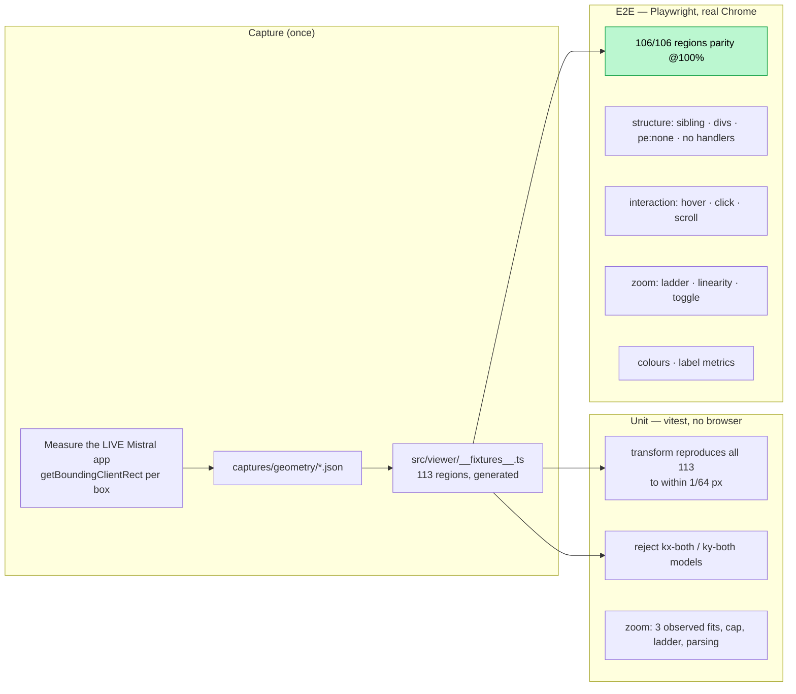

**The generated fixture is the trick.** Rather than asserting our transform against our
own arithmetic (circular), we checked in Mistral's *measured output* and assert against
that. A regression in the transform fails immediately and loudly.

```ts
// src/viewer/transform.test.ts
it('reproduces every one of the 113 measured regions to within one LayoutUnit', () => {
  let worst = 0
  for (const r of MEASURED_REGIONS) {
    const box = boundsToBox(
      asBounds(r.ocr),
      { nativeWidth: r.native.w, nativeHeight: r.native.h, scale: r.scale },
      { width: r.raster.w, height: r.raster.h },
    )
    worst = Math.max(worst,
      Math.abs(box.left   - r.measured.left),
      Math.abs(box.top    - r.measured.top),
      Math.abs(box.width  - r.measured.width),
      Math.abs(box.height - r.measured.height))
  }
  expect(worst).toBeLessThan(1 / 64)
})
```

And the model-rejection tests, which are what stop someone "simplifying" the transform
back to a single shared scale:

```ts
it('rejects the "reuse kx for both axes" model against measured data', () => {
  const b = asBounds({ x1: 40, y1: 473, x2: 643, y2: 619 })   // measured top = 400.4688
  const k = coordinateScales(page, raster)
  const correct = b.topLeftY * k.y * page.scale               // ~400.4795  ✅
  const wrong   = b.topLeftY * k.x * page.scale               // ~400.3074  ❌
  expect(Math.abs(correct - 400.4688)).toBeLessThan(1 / 64)
  expect(Math.abs(wrong   - 400.4688)).toBeGreaterThan((1 / 64) * 5)
})
```

The non-interactivity test is worth copying too, because it encodes a *deliberate
absence* that a well-meaning contributor would otherwise "fix":

```ts
test('clicking or hovering a bbox does nothing (display-only)', async ({ page }) => {
  const before = await scroller.evaluate(el => ({ top: el.scrollTop, left: el.scrollLeft }))
  const box = page.locator('.ocr-region').nth(3)
  await box.hover({ force: true })
  expect(await page.locator('.ocr-region[data-hovered="true"]').count()).toBe(0)
  await box.click({ force: true })
  expect(await page.locator('.ocr-region[data-hovered="true"]').count()).toBe(0)
  const after = await scroller.evaluate(el => ({ top: el.scrollTop, left: el.scrollLeft }))
  expect(after).toEqual(before)
})
```

### Two testing traps we hit

**① Lazy rendering vs. bulk measurement.** Pages render lazily (Mistral does the same via
a `shouldRenderContent` prop), so a page scrolled out of view *unmounts its overlay*. The
first version of the parity test scrolled through all pages and then read every region —
finding page 3's regions missing. Fix: accumulate per page **while that page is mounted**.

**② Playwright device presets overwrite your overrides.** This is silently wrong:

```ts
use: {
  deviceScaleFactor: 1,
  viewport: { width: 1908, height: 832 },
  ...devices['Desktop Chrome'],     // ← overwrites BOTH of the above
}
```

Spread **first**, override after. Typechecking the config file caught this
(`TS2783: 'viewport' is specified more than once`) — a good argument for including config
files in `tsc`.

## 27. Reproducing the demo

```bash
git clone <this repo>
cd mistral-viewer-reverse-engineer/clone
npm install

npm run dev          # http://localhost:5199
npm run typecheck    # tsc -b  (includes vite/vitest/playwright configs)
npm test             # vitest  — 16 assertions, no browser needed
npm run test:e2e     # playwright — 14 tests in real Chrome
```

`npm run test:e2e` prints the headline:

```
compared 106/106 regions; worst error 0.000050 px (block-1-1 p2)
```

### The three fixtures

| Fixture | What it exercises |
|---|---|
| **ULTOMIRIS (3 pages, mixed page sizes)** | The local OCR JSON. Mixed page sizes (595×867 pt and 1728×2592 pt), two dpi values (85, 28), no images. The general case |
| **ULTOMIRIS (fresh capture)** | Same PDF, freshly captured JSON. **This is the geometry oracle** — the exact JSON whose rendering was measured in Mistral |
| **Image fixture (1 page, image block)** | Purpose-built: a JPEG at a known rectangle, plus text above/beside/below. Exercises `image` blocks, `image_id`, the data URI and the image card |

Switch between them with the dropdown in the header.

### Rebuilding the image fixture from scratch

Should you want the ground-truth image test yourself — a minimal PDF with an embedded
JPEG at a rectangle you choose, in pure Python with no dependencies:

```python
# 1. get a JPEG
#    pdftoppm -jpeg -r 12 -f 2 -l 2 input.pdf pg
data = open('pg-2.jpg','rb').read()          # read W,H from the SOF marker

PW, PH = 595.0, 842.0                        # page size, pt
IW, IH = 240.0, 180.0                        # image display size, pt
IX, IY = 300.0, 560.0                        # image lower-left, PDF user space (y UP)

objs = {
  1: b"<< /Type /Catalog /Pages 2 0 R >>",
  2: b"<< /Type /Pages /Kids [3 0 R] /Count 1 >>",
  3: f"<< /Type /Page /Parent 2 0 R /MediaBox [0 0 {PW} {PH}] "
     f"/Resources << /Font << /F1 5 0 R >> /XObject << /Im0 6 0 R >> >> "
     f"/Contents 4 0 R >>".encode(),
  # 4 = content stream: text + `q IW 0 0 IH IX IY cm /Im0 Do Q`
  5: b"<< /Type /Font /Subtype /Type1 /BaseFont /Helvetica >>",
  6: b"<< /Type /XObject /Subtype /Image /Width W /Height H /ColorSpace /DeviceRGB "
     b"/BitsPerComponent 8 /Filter /DCTDecode /Length N >>\nstream\n" + data + b"\nendstream",
}
# ... write objects, xref table, trailer ...
```

A JPEG embeds **raw** with `/Filter /DCTDecode` — no re-encoding needed, which is what
makes this so short. Then:

```
top-left pt coords = x:[IX, IX+IW], y:[PH-IY-IH, PH-IY]
expected raster bbox = those × dpi/72,  dpi = floor(1024 / (PH/72))
```

Compare against what the API returns. If `y1` comes back small, the space is top-left; if
it comes back near `PH×dpi/72`, it is y-up.

---

# Part VIII — Production integration

> **Audience for this part:** a frontend developer who already has a PDF and an OCR JSON
> and needs this capability inside an existing live application. You do not need to read
> Parts II–VI to use this part, but §13 (the transform) and §32 (pitfalls) are worth ten
> minutes.

## 28. Integration guide for a frontend developer

### What you need

| Requirement | Detail |
|---|---|
| The PDF | as a URL, `ArrayBuffer` or `Blob` |
| The OCR JSON | must contain, per page, `dimensions.{width,height}` and blocks with the four bbox integers |
| PDF.js | `pdfjs-dist` (any v3–v6; the API notes in §25.4 cover v6) |
| A wrapper element | that you control, `position: relative` |
| Nothing else | no state manager, no canvas library, no SVG, no measuring library |

### The five-step recipe

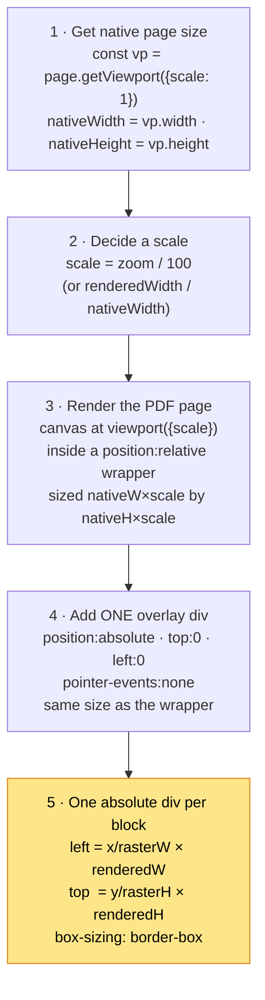

### Step 1 — the only PDF.js call you actually need

```ts
const pdf  = await pdfjsLib.getDocument({ url }).promise
const page = await pdf.getPage(pageNumber)          // 1-based
const { width: nativeWidth, height: nativeHeight } = page.getViewport({ scale: 1 })
```

`getViewport({scale: 1})` has **already** flipped the PDF's bottom-left origin to
top-left and applied any intrinsic `/Rotate`. Everything downstream is top-left, +y-down.

### Step 2 — pick your scale

Three equally valid strategies:

| Strategy | Formula | When |
|---|---|---|
| **Explicit zoom** (Mistral's) | `scale = zoomPercent / 100` | You have a zoom control |
| **Fit to width** | `scale = (containerWidth - gutter) / maxNativeWidth` | Responsive, no zoom control |
| **Fixed render width** | `scale = targetWidth / nativeWidth` | Thumbnails, print, fixed layouts |

If you want Mistral's exact initial behaviour:

```ts
const fit = Math.floor((container.clientWidth - 16) / maxNativeWidth * 100)
const cap = Math.floor(16384 / (maxNativeSide * devicePixelRatio) * 100)
const zoom = Math.min(fit, 100, cap)    // note the 100: never zoom IN to fit
```

### Step 3 — the wrapper and the page

```html
<!-- YOU own this element. position:relative is mandatory. -->
<div class="pdf-page-wrapper"
     data-pdf-page="1"
     style="position:relative; width:594.96px; height:867px">

  <!-- PDF.js owns everything in here -->
  <div class="pdf-page-content" style="position:relative">
    <canvas></canvas>
    <div class="textLayer"></div>
  </div>

  <!-- your overlay: a SIBLING, never a child of the above -->
  <div class="ocr-overlay"></div>
</div>
```

### Step 4 & 5 — the overlay

```tsx
function OcrOverlay({ blocks, raster, nativeWidth, nativeHeight, scale, hoveredId }) {
  const renderedWidth  = nativeWidth  * scale
  const renderedHeight = nativeHeight * scale

  return (
    <div
      style={{
        position: 'absolute', top: 0, left: 0,
        width: renderedWidth, height: renderedHeight,
        pointerEvents: 'none',            // ← click-through; keeps PDF text selectable
      }}
    >
      {blocks.map((b, i) => {
        const id = `block-${pageIndex}-${i}`
        const isHovered = hoveredId === id
        return (
          <div
            key={id}
            data-region-id={id}
            style={{
              position: 'absolute',
              boxSizing: 'border-box',    // ← border drawn INSIDE the box
              left:   (b.top_left_x / raster.width)  * renderedWidth,
              top:    (b.top_left_y / raster.height) * renderedHeight,
              width:  ((b.bottom_right_x - b.top_left_x) / raster.width)  * renderedWidth,
              height: ((b.bottom_right_y - b.top_left_y) / raster.height) * renderedHeight,
              border: `1px solid ${isHovered ? HOVER.border : COLORS[b.type].border}`,
              background: isHovered ? HOVER.fill : COLORS[b.type].fill,
              borderRadius: 4,
              pointerEvents: 'none',
            }}
          >
            <span style={{
              position: 'absolute', top: 0, left: 2,
              translate: '0 -100%',
              padding: '2px 4px',
              fontSize: 11, lineHeight: '12px',
              borderRadius: '4px 4px 0 0',
              width: 'max-content',
              background: isHovered ? HOVER.accent : COLORS[b.type].accent,
              color: isHovered ? HOVER.text : COLORS[b.type].text,
              pointerEvents: 'auto',      // only so the title tooltip works
            }} title={b.type}>{b.type}</span>
          </div>
        )
      })}
    </div>
  )
}
```

**That is the entire feature.** Everything else in this document is either explaining
*why* those five lines of arithmetic are right, or reproducing Mistral's surrounding
chrome.

### Wiring synchronisation

Keep one piece of state — `hoveredRegionId: string | null` — and drive it from wherever
your text lives:

```tsx
// your text panel, list, table, search results — whatever
<div
  data-block-id={id}
  onMouseEnter={() => setHoveredRegionId(id)}
  onMouseLeave={() => setHoveredRegionId(null)}
  onClick={() => scrollToRegion(id)}
>
  {block.content}
</div>
```

Or delegate once at the container, which is what Mistral does and which handles nested
content for free:

```tsx
<div
  onMouseOver={(e) => {
    const el = (e.target as HTMLElement).closest('[data-block-id]')
    setHoveredRegionId(el?.getAttribute('data-block-id') ?? null)
  }}
  onMouseLeave={() => setHoveredRegionId(null)}
  onClick={(e) => {
    const id = (e.target as HTMLElement).closest('[data-block-id]')?.getAttribute('data-block-id')
    if (id) scrollToRegion(id)
  }}
>
```

And scroll-to-region:

```ts
function scrollToRegion(id: string) {
  const region = regionIndex.get(id)
  const pageEl = container.querySelector(`[data-pdf-page="${region.pageNumber}"]`)
  const ky = nativeHeight / region.originalPageHeight
  const yInPage = region.bounds.topLeftY * ky * scale
  const pageTop = pageEl.getBoundingClientRect().top
                - container.getBoundingClientRect().top + container.scrollTop
  container.scrollTo({ top: Math.max(0, pageTop + yInPage - 30), behavior: 'smooth' })
}
```

Mistral uses `behavior: 'instant'`; `'smooth'` is nicer and changes nothing about the
geometry.

## 29. Minimal viable implementation (60 lines)

No framework, no build step. Drop this in a page with PDF.js loaded and it works.

```html
<div id="wrap" style="position:relative"></div>

<script type="module">
import * as pdfjsLib from 'https://cdn.jsdelivr.net/npm/pdfjs-dist@6/build/pdf.min.mjs'
pdfjsLib.GlobalWorkerOptions.workerSrc =
  'https://cdn.jsdelivr.net/npm/pdfjs-dist@6/build/pdf.worker.min.mjs'

const COLORS = {
  text:    ['rgba(225,125,210,0.1)', 'rgb(152,51,132)'],
  title:   ['rgba(6,126,255,0.1)',   'rgb(2,98,191)'],
  image:   ['rgba(88,220,6,0.1)',    'rgb(49,142,104)'],
  table:   ['rgba(255,93,89,0.1)',   'rgb(244,54,37)'],
  list:    ['rgba(177,144,240,0.1)', 'rgb(148,101,231)'],
  header:  ['rgba(0,0,0,0.06)',      'rgb(97,95,87)'],
  footer:  ['rgba(126,134,251,0.1)', 'rgb(96,96,248)'],
  caption: ['rgba(255,208,27,0.1)',  'rgb(255,175,1)'],
}
const FALLBACK = ['rgba(252,120,59,0.1)', 'rgb(250,80,15)']   // orange

async function render(pdfUrl, ocr, zoom = 1) {
  const wrap = document.getElementById('wrap')
  const pdf  = await pdfjsLib.getDocument({ url: pdfUrl }).promise

  for (const ocrPage of ocr.pages) {
    if (!ocrPage.dimensions?.width) continue           // no denominator → skip
    const page = await pdf.getPage(ocrPage.index + 1)
    const vp   = page.getViewport({ scale: zoom })

    // ---- the wrapper YOU own
    const holder = document.createElement('div')
    holder.dataset.pdfPage = String(ocrPage.index + 1)
    holder.style.cssText =
      `position:relative;width:${vp.width}px;height:${vp.height}px;background:#fff;margin:0 auto 16px`
    wrap.appendChild(holder)

    // ---- PDF.js canvas
    const canvas = document.createElement('canvas')
    const dpr = window.devicePixelRatio || 1
    canvas.width  = Math.floor(vp.width  * dpr)
    canvas.height = Math.floor(vp.height * dpr)
    canvas.style.width  = Math.floor(vp.width)  + 'px'
    canvas.style.height = Math.floor(vp.height) + 'px'
    holder.appendChild(canvas)
    const ctx = canvas.getContext('2d')
    ctx.setTransform(dpr, 0, 0, dpr, 0, 0)
    await page.render({ canvas, canvasContext: ctx, viewport: vp }).promise

    // ---- the overlay: ONE div, a sibling of the canvas
    const ov = document.createElement('div')
    ov.style.cssText =
      `position:absolute;top:0;left:0;width:${vp.width}px;height:${vp.height}px;pointer-events:none`
    holder.appendChild(ov)

    const { width: rw, height: rh } = ocrPage.dimensions
    for (const b of ocrPage.blocks ?? []) {
      const [fill, border] = COLORS[b.type] ?? FALLBACK
      const d = document.createElement('div')
      d.style.cssText = `
        position:absolute;box-sizing:border-box;border:1px solid ${border};
        background:${fill};border-radius:4px;pointer-events:none;
        left:${  b.top_left_x                    / rw * vp.width }px;
        top:${   b.top_left_y                    / rh * vp.height}px;
        width:${ (b.bottom_right_x - b.top_left_x) / rw * vp.width }px;
        height:${(b.bottom_right_y - b.top_left_y) / rh * vp.height}px;`
      d.innerHTML =
        `<span style="position:absolute;top:0;left:2px;translate:0 -100%;padding:2px 4px;
                      font:11px/12px Inter,system-ui,sans-serif;border-radius:4px 4px 0 0;
                      width:max-content;background:${border};color:#fff;pointer-events:auto"
               title="${b.type}">${b.type}</span>`
      ov.appendChild(d)
    }
  }
}

render('/doc.pdf', await (await fetch('/ocr.json')).json())
</script>
```

## 30. Framework variants

The overlay is just absolutely-positioned elements, so it ports trivially. Only the
arithmetic matters and it is identical everywhere.

### Vue 3

```vue
<template>
  <div class="wrapper" :style="{ position:'relative', width: rendered.w+'px', height: rendered.h+'px' }">
    <canvas ref="canvas" />
    <div class="overlay"
         :style="{ position:'absolute', top:0, left:0,
                   width: rendered.w+'px', height: rendered.h+'px', pointerEvents:'none' }">
      <div v-for="(b, i) in blocks" :key="i" :style="boxStyle(b)" />
    </div>
  </div>
</template>

<script setup>
const boxStyle = (b) => ({
  position: 'absolute', boxSizing: 'border-box', borderRadius: '4px',
  border: `1px solid ${COLORS[b.type][1]}`, background: COLORS[b.type][0],
  left:   b.top_left_x / raster.width  * rendered.w + 'px',
  top:    b.top_left_y / raster.height * rendered.h + 'px',
  width:  (b.bottom_right_x - b.top_left_x) / raster.width  * rendered.w + 'px',
  height: (b.bottom_right_y - b.top_left_y) / raster.height * rendered.h + 'px',
})
</script>
```

### Svelte

```svelte
<div class="overlay" style="position:absolute;top:0;left:0;
     width:{rendered.w}px;height:{rendered.h}px;pointer-events:none">
  {#each blocks as b}
    <div style="position:absolute;box-sizing:border-box;border-radius:4px;
                border:1px solid {COLORS[b.type][1]};background:{COLORS[b.type][0]};
                left:{b.top_left_x / raster.width * rendered.w}px;
                top:{b.top_left_y / raster.height * rendered.h}px;
                width:{(b.bottom_right_x - b.top_left_x) / raster.width * rendered.w}px;
                height:{(b.bottom_right_y - b.top_left_y) / raster.height * rendered.h}px" />
  {/each}
</div>
```

### Angular

```html
<div class="overlay" [ngStyle]="overlayStyle">
  <div *ngFor="let b of blocks; index as i" [ngStyle]="boxStyle(b)"></div>
</div>
```

```ts
boxStyle(b: Block) {
  return {
    position: 'absolute', boxSizing: 'border-box', borderRadius: '4px',
    left:   `${b.top_left_x / this.raster.width  * this.rendered.w}px`,
    top:    `${b.top_left_y / this.raster.height * this.rendered.h}px`,
    width:  `${(b.bottom_right_x - b.top_left_x) / this.raster.width  * this.rendered.w}px`,
    height: `${(b.bottom_right_y - b.top_left_y) / this.raster.height * this.rendered.h}px`,
  }
}
```

### If you must use an existing PDF component

Any wrapper works, provided you can get two things:

1. the page's **native** (scale-1) size, and
2. a **`position: relative` element that exactly bounds the rendered page**

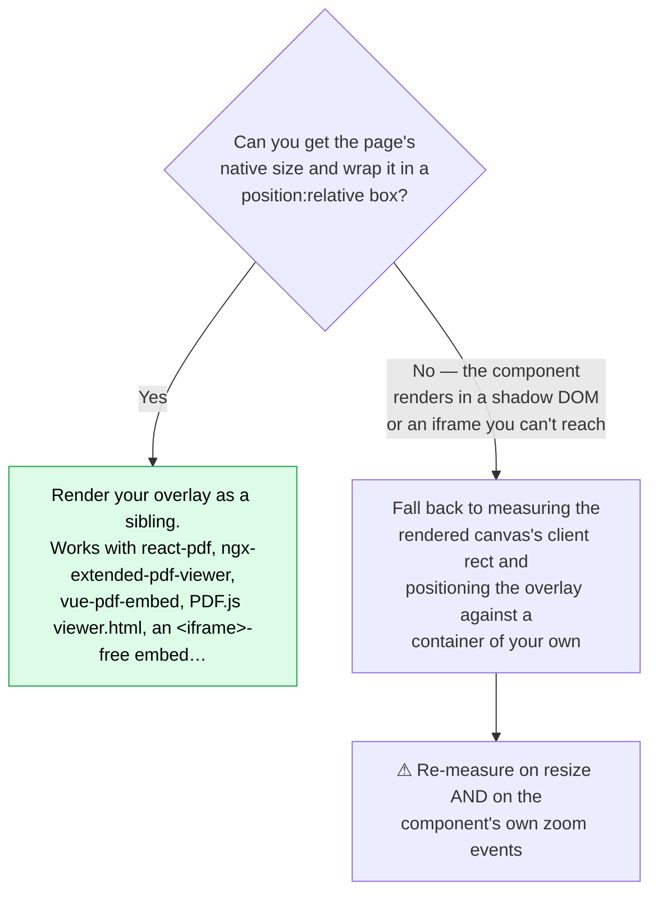

With `react-pdf` specifically, note its CSS-variable quirk (§16): `--scale-factor` is
hard-coded to `"1"` and the real scale lives in `--user-unit`. Read
`--total-scale-factor`, or better, ignore the variables and compute from
`width / nativeWidth`.

## 31. Performance at scale

The naive version is fine to surprisingly large numbers, but here is the ladder.

| Blocks per page | Approach | Notes |
|---|---|---|
| **< 200** | one div per block, all pages mounted | Our clone renders 106 boxes across 3 pages with no perceptible cost |
| **200 – 2 000** | lazy-render pages, `React.memo` the box | Mistral does exactly this via `shouldRenderContent` + a memoised `Region` |
| **2 000 – 20 000** | virtualise by page **and** cull boxes outside the viewport | Cheap because culling is a pure arithmetic test on numbers you already have |
| **> 20 000** | consider a single canvas overlay | You give up per-box CSS, hover via DOM, and accessibility. Rarely worth it |

### Lazy page rendering

```ts
const io = new IntersectionObserver((entries) => {
  for (const e of entries) {
    const n = Number(e.target.getAttribute('data-pdf-page'))
    e.isIntersecting ? visible.add(n) : visible.delete(n)
  }
  setVisiblePages(new Set(visible))
}, { root: scrollContainer, rootMargin: '150%' })   // render 1.5 viewports ahead
```

### Memoise the box, not the overlay

```tsx
const RegionBox = memo(function RegionBox({ region, page, isHovered }) { … })
```

Because `isHovered` changes for exactly two boxes per hover event (the old and the new),
memoising at the box level means a hover re-renders 2 elements, not N.

### Recompute geometry only when scale changes

The transform is cheap (four multiplications), but the allocation of style objects is
not free at scale. Derive per-page geometry in a `useMemo` keyed on
`[nativeSizes, zoom]`, exactly as the clone does:

```ts
const pageDimensions = useMemo(() => {
  const m = new Map<number, PageDimensions>()
  const scale = zoom / 100
  native.forEach((n, i) => m.set(i, {
    width: n.nativeWidth * scale, height: n.nativeHeight * scale,
    nativeWidth: n.nativeWidth, nativeHeight: n.nativeHeight, scale,
  }))
  return m
}, [native, zoom])
```

> **A subtle one:** make sure the array you feed that `useMemo` has a **stable
> identity**. Ours originally did `pdfState.status === 'ready' ? pdfState.native : []`,
> creating a fresh `[]` on every render and defeating the memo. The linter caught it.
> Use a module-level constant for the empty case.

### Do not put a CSS transform on the overlay to "zoom"

Tempting — `transform: scale(1.5)` on the container looks like a free zoom. It is not:

- the canvas stays at its old resolution and goes blurry
- border widths and label text scale too, so a 1 px border becomes 1.5 px
- hit-testing and `getBoundingClientRect()` get harder to reason about

Mistral re-renders the canvas at the new scale and re-lays-out the overlay. Do that.

## 32. Pitfalls and how to avoid them

Ranked by how much time each one is likely to cost you.

### ① Assuming one shared scale factor

**Symptom:** boxes are perfect on most pages, and subtly wrong on one axis on others.
**Cause:** using `nativeWidth/rasterWidth` for both axes.
**Fix:** compute `kx` and `ky` separately. See §14 — this is *the* finding of this
document. Add a test with a fixture whose page and raster aspect ratios differ, or you
will never catch it.

### ② Assuming PDF coordinates are bottom-up

**Symptom:** everything mirrored vertically; headers at the bottom.
**Cause:** applying a Y-flip because "PDF is bottom-left origin".
**Fix:** don't. `getViewport()` already handled it, and the OCR raster is top-left
anyway. Sanity check: your `header` blocks should have the *smallest* y.

### ③ Forgetting `box-sizing: border-box`

**Symptom:** every box is 2 px too large; boxes look consistently "loose".
**Cause:** default `content-box` adds the 1 px border outside the computed size.
**Fix:** `box-sizing: border-box` on the box.

### ④ Overlay as a child of the PDF component's subtree

**Symptom:** the overlay vanishes on zoom, or duplicates, or the library warns about
unexpected children.
**Cause:** the PDF library owns and re-renders that subtree.
**Fix:** make the overlay a **sibling** inside a wrapper you own (§16).

### ⑤ Forgetting `pointer-events: none`

**Symptom:** users can't select text in the PDF; tooltips don't fire; clicks land on
invisible boxes.
**Cause:** an opaque-to-input overlay covering the whole page.
**Fix:** `pointer-events: none` on the container; re-enable only on what must be
interactive.

### ⑥ Treating `dimensions` as constant across pages

**Symptom:** one page correct, others progressively wrong.
**Cause:** hoisting `dimensions` out of the per-page loop, or assuming a document-level
raster size.
**Fix:** `dimensions` is **per page**, and so is `dpi`. Our ULTOMIRIS fixture has
703×1024@85 and 672×1008@28 in the same document.

### ⑦ Assuming block counts are stable across OCR runs

**Symptom:** cached bboxes drift; ids point at the wrong block after a re-run.
**Cause:** OCR output is not deterministic — we measured 35 vs 45 blocks on the same page
from two runs.
**Fix:** never persist `block-<page>-<ordinal>` ids across runs; re-derive from the
response you are rendering.

### ⑧ Prefixing `image_base64`

**Symptom:** broken images, `data:image/jpeg;base64,data:image/jpeg;base64,...`.
**Cause:** assuming the field is bare base64.
**Fix:** it is a **complete data URI**. Use it verbatim.

### ⑨ Treating `images: []` as an error

**Symptom:** a spurious error state on perfectly good documents.
**Cause:** assuming `include_image_base64: true` guarantees images.
**Fix:** detection is content-dependent; empty is normal.

### ⑩ Not handling `dimensions: null`

**Symptom:** `NaN` everywhere, or boxes at `left: NaN`.
**Cause:** dividing by a missing denominator.
**Fix:** skip the page's regions entirely, as Mistral does:
`if (!width || !height) return []`.

### ⑪ Reading `--scale-factor` from react-pdf

**Symptom:** your scale is always 1.
**Cause:** react-pdf hard-codes `--scale-factor: "1"` and puts the real scale in
`--user-unit`.
**Fix:** read `--total-scale-factor`, or compute from `width / nativeWidth`.

### ⑫ Measuring layout before React has committed

**Symptom:** zoom anchoring jumps; scroll restoration lands in the wrong place.
**Cause:** measuring `getBoundingClientRect()` in the same tick you set state.
**Fix:** `flushSync(() => setZoom(next))` before re-measuring — exactly what Mistral does.

### ⑬ Expecting sub-pixel exactness from `getBoundingClientRect()`

**Symptom:** tests fail by ~0.01 px.
**Cause:** Blink quantises layout to 1/64 px.
**Fix:** assert with a tolerance of at least 1/64 (0.015625). Do not chase it.

### Quick self-check

Before shipping, verify each of these on a document whose page and raster aspect ratios
**differ**:

- [ ] a `header` block sits at the top of the page, not the bottom
- [ ] the left edge of a left-aligned block lines up across all such blocks
- [ ] a bottom-of-page `footer` block sits at the bottom
- [ ] boxes stay aligned at 25 %, 100 % and 400 % zoom
- [ ] boxes stay aligned on page 2 of a document with mixed page sizes
- [ ] text in the PDF is still selectable with the overlay on
- [ ] a box's border does not make it visibly 2 px larger than the content
- [ ] `images: []` and `dimensions: null` do not throw

---

# Part IX — Reference

## 33. Verification results

### Coordinate parity — the headline

| Check | Scope | Result |
|---|---|---|
| **Playwright, clone vs Mistral** | 106 ULTOMIRIS regions @ 100 %, 4 edges each | **worst error 0.000050 px** |
| Playwright, image fixture | 7 regions incl. the `image` block | within 2/64 px |
| Vitest, pure transform | all 113 measured regions | worst error **< 1/64 px** |
| Model fitting, Mistral only | 13 boxes × 4 quantities, 5 models | correct model **11–14× better** than alternatives |
| Zoom sweep, Mistral only | 7 zoom levels | **0.000000 px** at all six ladder zooms |

0.000050 px is four orders of magnitude below the 1/64 px granularity of
`getBoundingClientRect()` itself. For practical purposes the geometry is identical.

### Behaviour parity

| Behaviour | Status | Where asserted |
|---|---|---|
| Overlay is a **sibling**, not a child | ✅ verified | `overlay is a SIBLING of the page content` |
| Boxes are `<div>`s — no SVG, no canvas | ✅ verified | `boxes are divs` |
| Container `pointer-events: none` | ✅ verified | `overlay container is pointer-events:none` |
| Boxes carry **zero** handlers | ✅ verified | same |
| Label `pointer-events: auto` + `title` | ✅ verified | same |
| `box-sizing: border-box`, 1 px, 4 px radius | ✅ verified | same |
| Hovering/clicking a bbox does nothing | ✅ verified | `clicking or hovering a bbox does nothing` |
| Panel hover highlights exactly one box | ✅ verified | `hovering a panel block highlights exactly one box` |
| Hover reverts on mouseleave | ✅ verified | same |
| Hover uses the brand pair, not the type scheme | ✅ verified | same |
| Panel click scrolls **vertically only** | ✅ verified | `clicking a panel block scrolls the PDF vertically only` |
| Scroll target formula + browser clamp | ✅ verified | `the scroll target matches the verified formula` |
| Zoom ladder | ✅ verified | `the ladder and the free-text box behave as verified` |
| Free-text zoom accepts arbitrary in-range ints | ✅ verified | same |
| Rejects `< 25` and `> effectiveMax` | ✅ verified | same |
| Geometry scales linearly | ✅ verified | `geometry scales linearly` |
| Overlay exactly covers the wrapper | ✅ verified | same |
| Regions toggle | ✅ verified | `the regions toggle hides and shows the overlay` |
| Type → colour mapping | ✅ verified | `block types map to the verified colour schemes` |
| Label position/size/padding/radius | ✅ verified | `the label sits above the box` |
| `min(fit, 100, cap)` initial zoom | ✅ verified | vitest, 3 observed cases |
| Canvas cap incl. DPR | ✅ verified | vitest, DPR 1 and 2 |
| `image_base64` verbatim as `` | ✅ verified live | 23747-char data URI, natural 295×221 |
| Image badges | ✅ verified live | `x: 360, y: 121` and `295 × 221` |
| Current page = greatest visible height | implemented | — |
| Zoom preserves viewport centre | implemented | — |
| Canvas floored, overlay not | implemented | — |
| `image_id` join key | implemented | — |
| Per-page independent `kx`/`ky` | ✅ verified | ULTOMIRIS p1 vs p2/p3 |

**Totals: 16 vitest assertions + 14 Playwright tests, all passing.** Typecheck and
production build clean.

## 34. Differences between clone and original

Full detail in `captures/reports/CLONE_DIFFERENCES.md`. Summary:

### Deliberate

| Area | Mistral | Clone | Impact |
|---|---|---|---|
| PDF wrapper | `react-pdf` + PDF.js 5.4.296 | `pdfjs-dist` 6.3.289 direct | class names and CSS vars differ; **geometry identical** |
| Right panel | TipTap/ProseMirror, editable | plain React, read-only | same `data-block-*` contract and sync semantics |
| Markdown | `marked` via TipTap schema | `marked` direct | fine typography differs |
| App chrome | full console UI | minimal header + fixture picker | out of scope |
| Colours | Tailwind design tokens | the **measured** RGB values | identical values, different mechanism |
| Editing / translation / Markdown tab | present | not implemented | out of scope |

### Forced by environment

| Difference | Explanation |
|---|---|
| Initial zoom **54 %** vs Mistral's 46 % | Identical formula, different pane width (949 px vs 823 px). The formula is asserted against all three of Mistral's observed cases |
| DPR 1 only | The capture machine reported DPR 1; DPR ≠ 1 unverified on both sides |
| Primary fixture ≠ measured fixture | The local JSON and the fresh capture are different OCR runs (35 vs 45 blocks on page 2). Tests run against the fresh capture — the JSON whose rendering was actually measured |

### Quirks deliberately preserved

1. Overlay **not** floored while the canvas **is** (+0.719 px at 39 %, 0.000 at ladder zooms)
2. Boxes not clamped to the page — no `overflow: hidden`
3. No device-pixel snapping; `scale` is an unquantised float
4. No CropBox/MediaBox reconciliation
5. No rotation handling
6. Vertical-only region scroll
7. Single hover slot — exactly one box can highlight

### One deliberate improvement

Because the clone does not reconstruct markdown from blocks, it does **not** inherit
Mistral's silent sync failure when the re-joined block contents fail to string-equal
`page.markdown` (§22). Our sync always works, which means the clone will show working
sync in cases where Mistral's would show none.

## 35. What remains unverified

Stated rather than guessed.

| # | Item | Why, and what is known |
|---|---|---|
| 1 | **`devicePixelRatio ≠ 1`** | The capture machine reported DPR 1 throughout. Source analysis confines DPR to the max-zoom cap, which the clone implements identically and unit-tests at DPR 1 and 2. The box transform contains no DPR term |
| 2 | **Whether the image card's own handlers ever resolve** | They key on the image id (`img-0.jpeg`) while mounted block regions key on `block-0-N`. Hovering inside an image block *does* highlight correctly, but that is attributable to the enclosing `[data-block-id]` handler. The card is nested inside the block wrapper, so it could not be isolated with synthetic events. Possibly a latent no-op in Mistral |
| 3 | **`formatDetectedRegions` in situ** | Fully read from source (image id label, global `regionNumber`, no `colorScheme` → orange) but never observed mounted, because `include_blocks` was true in every captured run |
| 4 | **Page rotation** | No rotate control exists in the playground; `data-main-rotation="0"` was the only rotation attribute seen. No rotated fixture was tested |
| 5 | **`equation`, `code`, `signature`, `aside_text` rendering** | Types and colours come from the SDK schemas and are implemented, but no fixture produced them. Seen live: `text`, `title`, `image`, `table`, `list`, `header`, `footer`, `caption`, `references` |
| 6 | **Confidence-score labels** | Mistral's `data-block-label` becomes `blockLabel.label({blockType, confidence})` when confidence scores are present. Our fixtures were captured without them; the code path was not built |
| 7 | **`dimensions` dpi rule** | 5/5 samples consistent with `floor(1024 / longSideInches)`, but this is inferred from outputs, not read from code. Irrelevant to the viewer |

## 36. Artifact index

Everything is under `captures/` (17 MB) plus `reference/` and `clone/`.

### Reports

| File | Contents |
|---|---|
| `captures/reports/REVERSE_ENGINEERING.md` | The full specification, 1257 lines, incl. the **FINAL VERIFIED** section |
| `captures/reports/coordinate-system.md` | Standalone coordinate derivation, 526 lines |
| `captures/reports/CLONE_DIFFERENCES.md` | Parity table + every difference, 255 lines |
| `captures/reports/PHASE1-observations.md` | First-contact observations: framework, env, DPR, CSS vars |
| `mistral-viewer-reverse-engineer.md` | **This document** |

### Measurements (machine-readable)

| File | Contents |
|---|---|
| `captures/geometry/xy-independence-100pct.json` | **The geometry oracle.** 106 regions, 3 pages, native/raster/scale + measured rects |
| `captures/geometry/image-block-geometry.json` | 7 regions incl. the `image` block, with ground truth |
| `captures/geometry/zoom-sweep.json` | 7 zoom levels × full page/canvas/overlay/box geometry |
| `captures/geometry/color-tokens-resolved.json` | All 13 schemes + brand + chrome, resolved to RGB |
| `captures/geometry/ocr-block-schemas.json` | The 13 bbox-carrying schemas and their type literals |
| `captures/geometry/ocr-json-structure.txt` | Full structural dump of the local OCR JSON |

### Runtime observations

| File | Contents |
|---|---|
| `captures/runtime/regions-live-zoom39.json` | Live region props from React fiber + per-box computed styles |
| `captures/runtime/interaction-clean-200pct.json` | Clean hover/click/scroll test at 200 % |
| `captures/runtime/interaction-hover-click.json` | First-pass interaction test at 39 % |
| `captures/runtime/image-cards-and-panel.json` | Image cards, join keys, region labels |
| `captures/runtime/image-card-sync-test.json` | Image-card sync probe |

### Network

| File | Contents |
|---|---|
| `captures/network/ultomiris-run.json` | The 3-page run: **request body** + full response |
| `captures/network/image-fixture-run.json` | The image run: request + response + image metadata |
| `captures/network/ocr-response-live.json` | An earlier single-page response |
| `captures/network/intercepted-requests.json` | Full interceptor log (telemetry PII redacted) |

### Code

| Path | Contents |
|---|---|
| `captures/js/chunks/` | All 110 production chunks, verbatim (15 MB) |
| `captures/js/pretty/` | 4 beautified chunks (1.2 MB) |
| `captures/js/extracted/` | 8 verbatim de-minified slices + `PROVENANCE.md` with line-level attribution |
| `clone/` | The working implementation |
| `reference/` | Fixtures: PDFs + OCR responses |

### Screenshots

| File | Contents |
|---|---|
| `captures/screenshots/03-visual-tab-with-regions.png` | **Mistral** rendering boxes |
| `captures/screenshots/04-image-fixture-with-image-block.png` | **Mistral** rendering the image fixture |
| `captures/screenshots/clone-02-fixed.png` | **Clone** rendering ULTOMIRIS |
| `captures/screenshots/clone-03-image-fixture.png` | **Clone** rendering the image fixture |
| `captures/screenshots/00…02-*.png` | Login, authenticated, first viewer load |

### The extracted source slices

Each is a verbatim slice of a beautified production chunk, with provenance recorded:

| Extract | Source chunk | Module |
|---|---|---|
| `DetectedRegionOverlay.module-276369.js` | `1ingfc0dby6lt.js` | **276369** |
| `PdfPageWrapper-with-overlay.js` | `3iak-lexg_g4a.js` | — |
| `usePdfViewer-zoom-scroll.js` | `3iak-lexg_g4a.js` | — |
| `IntersectionObserver-currentPage.js` | `3iak-lexg_g4a.js` | — |
| `react-pdf-Page-cssvars.js` | `3iak-lexg_g4a.js` | react-pdf `<Page>` |
| `formatDetectedRegions-builders.js` | `1-yqrukkz80tf.js` | 887531 |
| `tiptap-blockWrapper-extension.js` | `1-yqrukkz80tf.js` | — |
| `ImageFileViewer-with-overlay.js` | `25kqdw_iij2b8.js` | — |

---

## Closing note

The whole feature reduces to four lines of arithmetic:

```
left   = x       / rasterWidth  × renderedWidth
top    = y       / rasterHeight × renderedHeight
width  = (x2-x1) / rasterWidth  × renderedWidth
height = (y2-y1) / rasterHeight × renderedHeight
```

…placed in absolutely-positioned divs inside a `pointer-events: none` container that is
a **sibling** of the PDF page.

Everything else in this document exists because those four lines have exactly one
correct reading and several plausible wrong ones — and because the difference between
them is invisible on most documents and glaring on the one that matters.

The two things worth carrying away if you build this yourself:

1. **Test with a fixture whose page and raster aspect ratios differ.** Without one, a
   single-shared-scale bug is undetectable.
2. **Measure, don't infer.** Every number in this document that mattered — `kx ≠ ky`,
   the 1/64 px floor, `ceil` not `round`, the 3 px label offset, the data-URI prefix —
   came from a measurement, and several contradicted a reasonable guess.

---

*Investigation and implementation: 2026-09-08. Target build `2026.9.8-main-38760-4616289`.
All claims labelled **[SRC]**, **[MEAS]**, **[SRC+MEAS]** or **[HYP]** per the table at
the top of this document.*
